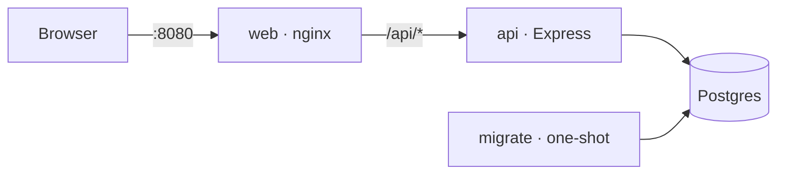
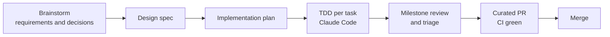

# FociToDo

[](https://github.com/charlesmalo/FociToDo/actions/workflows/ci.yml)
[](https://github.com/charlesmalo/FociToDo/actions/workflows/ci.yml)

A to-do application — TypeScript, Express, Postgres and React — built to demonstrate clean architecture, correctness under concurrency and thorough automated testing. **Docker is the only prerequisite.**


## Quick start

Requires Docker Desktop (or Docker Engine) with Compose v2.24+. Nothing else — no host Node/npm; every command below runs in a container.

```bash
git clone https://github.com/charlesmalo/FociToDo.git
cd FociToDo
docker compose up --build -d --wait
```

`--wait` blocks until `docker compose` can confirm the stack is actually ready, then exits `0`; it exits non-zero if a service fails to become healthy (the one-shot `migrate` service runs to completion first and its exit `0` counts as success, not a failure).

**Check it's up:**

```bash
curl -fsS http://localhost:8080/api/health
docker compose ps
```

Expected: `curl` prints something like `{"status":"ok","db":"up","schemaVersion":"<latest migration>"}` and exits `0` (the `-f` flag makes it fail on a non-2xx response); `docker compose ps` shows `db`, `api` and `web` as `healthy`.

| URL                            | What                               |
| ------------------------------ | ---------------------------------- |
| http://localhost:8080          | The app                            |
| http://localhost:8080/api/docs | Interactive API explorer (OpenAPI) |

Port 8080 busy? Copy `.env.example` to `.env` and set `WEB_PORT`.
Stop with `docker compose down` (keeps data) or `docker compose down -v` (deletes data).

**Smoke test (optional):** proves the API end to end through nginx — create, list, update under optimistic locking, complete, delete. POSIX `sh`-friendly; no `jq` required.

```bash
BASE=http://localhost:8080/api

# Create — the id comes from the Location header, the version from ETag.
create=$(curl -sS -i -X POST "$BASE/todos" -H 'Content-Type: application/json' \
  -d '{"title":"Buy milk","dueDate":"2026-10-01"}')
echo "$create"
id=$(printf '%s' "$create" | grep -i '^Location:' | sed 's#.*/todos/##' | tr -d '\r')
etag=$(printf '%s' "$create" | grep -i '^ETag:' | sed 's/^ETag: *//' | tr -d '\r')

# List
curl -sS "$BASE/todos"

# Update — send the last ETag back as If-Match; a stale one gets 412.
update=$(curl -sS -i -X PATCH "$BASE/todos/$id" -H "If-Match: $etag" \
  -H 'Content-Type: application/json' -d '{"title":"Buy oat milk"}')
echo "$update"
etag=$(printf '%s' "$update" | grep -i '^ETag:' | sed 's/^ETag: *//' | tr -d '\r')

# Complete — idempotent, no If-Match needed.
complete=$(curl -sS -i -X POST "$BASE/todos/$id/complete")
echo "$complete"
etag=$(printf '%s' "$complete" | grep -i '^ETag:' | sed 's/^ETag: *//' | tr -d '\r')

# Delete — requires the current If-Match.
curl -sS -i -X DELETE "$BASE/todos/$id" -H "If-Match: $etag"
```

Each command prints the full response; the last `DELETE` should print `HTTP/1.1 204 No Content`. If `grep`/`sed` aren't available, read `id` from the printed `Location` header and `etag` from the printed `ETag` header by hand and substitute them into the next command.

## Running the tests

```bash
docker compose --profile test run --rm --build test
```

Exit code `0` means the full gate passed: format check, lint (including architecture-boundary rules), type checks, and every unit, integration, concurrency and component test against a throwaway RAM-backed Postgres, at **100% coverage**. Any other exit code means something failed — scroll up to the failing step's output. Report: `reports/coverage/index.html`.

This is safe to run while the stack from Quick start is still up: the test profile starts its own throwaway `db-test` Postgres, separate from the stack's `db`, and the two don't share ports or data.

Single test file, for contributors (runs in the same container image as the gate, against the same throwaway `db-test`):

```bash
docker compose --profile dev run --rm dev npx vitest run <file>
```

See [CLAUDE.md](CLAUDE.md) for the rest of the developer commands (format, lint, etc.).

End-to-end (real browser against the full stack, isolated from your demo data). Teardown runs even if the tests fail:

```bash
(docker compose -p foci-e2e -f compose.yaml -f compose.e2e.yaml run --rm --build e2e; \
 rc=$?; docker compose -p foci-e2e -f compose.yaml -f compose.e2e.yaml down -v; exit $rc)
```

Exit code `0` means every journey passed. Report: `reports/e2e/index.html`.

### Troubleshooting

- **Port 8080 already in use:** copy `.env.example` to `.env` and set `WEB_PORT`.
- **Can the stack and the tests run at the same time?** Yes — the test profile uses its own throwaway `db-test` Postgres, isolated from the stack's `db`.
- **Linux: `reports/` owned by root:** files under `reports/` are created by the container user; remove them with `docker run --rm -v "$PWD":/w alpine rm -rf /w/reports` or `sudo`.

### For AI agents

Every command on this page is non-interactive and reports success or failure through its exit code — no need to parse logs or guess:

- Boot with `docker compose up --build -d --wait`; non-zero exit means a service failed to become healthy.
- Verify with `curl -fsS http://localhost:8080/api/health` (non-zero exit on a non-2xx response) and `docker compose ps`.
- Run the full gate with `docker compose --profile test run --rm --build test`; exit `0` is the only passing result.
- Run e2e with the subshell command above so teardown always runs regardless of the test outcome.
- Never run host `npm`/`node` — tooling runs in Docker via `docker compose --profile dev run --rm dev <cmd>`.
- Contributor rules (TDD, architecture boundaries, commit format) are in [CLAUDE.md](CLAUDE.md).

## Design overview



- **Monorepo:** `packages/shared` (Zod contract), `apps/api` (Express), `apps/web` (React). The shared schemas drive API validation, web forms and the OpenAPI document.
- **Backend layers:** `http → service → domain`, storage behind ports with Postgres and in-memory adapters, wired by hand in one composition root. Boundaries are lint-enforced.
- **Concurrency:** optimistic locking with `ETag`/`If-Match` (412 on conflict), idempotent complete/incomplete, and `Idempotency-Key` on create — all enforced in SQL.
- **Errors:** RFC 9457 problem details with per-field validation errors.
- **Why OpenAPI?** A standard, machine-readable contract generated from the same Zod schemas the API validates with, so docs can't drift; it gives reviewers an interactive page to try every endpoint at `/api/docs`.

More: [architecture](docs/architecture.md) · [API and sequence diagrams](docs/api.md) · [concurrency](docs/concurrency.md) · [testing](docs/testing.md) · [decision records](docs/decisions/README.md)

## Testing strategy

| Layer               | Proves                                                              |
| ------------------- | ------------------------------------------------------------------- |
| Shared schema       | Every validation rule and boundary                                  |
| Domain + service    | Business rules and error selection (in-memory storage, fixed clock) |
| Repository contract | In-memory and Postgres adapters behave identically                  |
| HTTP integration    | Status codes, headers, problem details, OpenAPI conformance         |
| Concurrency         | Parallel requests never lose updates or create duplicates           |
| Web components      | UI states, validation, conflict and retry handling                  |
| End-to-end          | The deployed stack works in a real browser                          |

Tests mirror source paths (`src/a/B.ts` → `tests/a/B.test.ts`). See [docs/testing.md](docs/testing.md).

## Assumptions

1. Single user; no authentication.
2. "Overdue" means incomplete with a due date before **today in UTC**; near midnight this can differ from the local date.
3. Past due dates are allowed (e.g. logging a late task), back to year 0001.
4. Updates are partial (`PATCH`); `null` clears the description or due date; the title cannot be cleared.
5. Complete/incomplete are idempotent and do not require `If-Match`.
6. Delete is permanent.
7. No pagination; lists are expected to stay small.
8. Idempotency keys apply to creates only and expire after 24 hours; a replay returns the original response.
9. Timestamps are stored in UTC; the UI shows them in the viewer's locale. Due dates are calendar dates and never shift.
10. Titles sort case-insensitively; todos without a due date sort last.

## Trade-offs

- **Postgres over a file store:** one more container, in exchange for transactions and constraints that make the concurrency guarantees simple and verifiable.
- **Required `If-Match`:** clients must track ETags; in return lost updates are impossible.
- **Server-side UTC overdue:** consistent filtering and badges, at the cost of the midnight edge case above.
- **No pagination, auth, soft delete or `completedAt`:** not required by the brief; each would add API surface and tests without improving correctness.
- **Single page with a modal:** covers every operation with the least UI code; the panels are independent of the dialog if a different layout is preferred.

## How this was built



Built with Claude Code as a pair programmer under the rules in [CLAUDE.md](CLAUDE.md). Requirements, decisions and the plan are in [docs/superpowers](docs/superpowers); every architectural choice has an [ADR](docs/decisions/README.md). Each work package was reviewed before merging; review reports, the requirements traceability matrix and verification evidence live in the companion repository **[FociToDo-review](https://github.com/charlesmalo/FociToDo-review)**. AI-assisted commits carry a `Co-Authored-By` trailer.

## Project layout

```
packages/shared/   Zod contract (schemas, types, problem details)
apps/api/          Express API: domain · service · repository (postgres, in-memory) · http
apps/web/          React app: api client · todo feature · styles
e2e/               Playwright journeys
docs/              Guides, ADRs, spec and plan
Dockerfile         One multi-stage build: test · api · migrate · web · e2e
compose.yaml       Default stack + test/dev profiles; compose.e2e.yaml overlay
```
