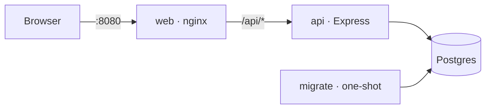
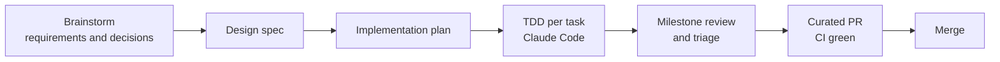

# FociToDo

[](https://github.com/charlesmalo/FociToDo/actions/workflows/ci.yml)
[](https://github.com/charlesmalo/FociToDo/actions/workflows/ci.yml)

A to-do application — TypeScript, Express, Postgres and React — built to demonstrate clean architecture, correctness under concurrency and thorough automated testing. **Docker is the only prerequisite.**


## Quick start

Requires Docker Desktop (or Docker Engine) with Compose v2.24+.

```bash
git clone https://github.com/charlesmalo/FociToDo.git
cd FociToDo
docker compose up --build -d
```

| URL                            | What                               |
| ------------------------------ | ---------------------------------- |
| http://localhost:8080          | The app                            |
| http://localhost:8080/api/docs | Interactive API explorer (OpenAPI) |

Port 8080 busy? Copy `.env.example` to `.env` and set `WEB_PORT`.
Stop with `docker compose down` (keeps data) or `docker compose down -v` (deletes data).

## Running the tests

```bash
docker compose --profile test run --rm --build test
```

Runs the format check, lint (including architecture-boundary rules), type checks, and every unit, integration, concurrency and component test against a throwaway RAM-backed Postgres, failing below **100% coverage**. Report: `reports/coverage/index.html`.

End-to-end (real browser against the full stack, isolated from your demo data):

```bash
docker compose -p foci-e2e -f compose.yaml -f compose.e2e.yaml run --rm --build e2e
docker compose -p foci-e2e -f compose.yaml -f compose.e2e.yaml down -v
```

Report: `reports/e2e/index.html`.

## Design overview



- **Monorepo:** `packages/shared` (Zod contract), `apps/api` (Express), `apps/web` (React). The shared schemas drive API validation, web forms and the OpenAPI document.
- **Backend layers:** `http → service → domain`, storage behind ports with Postgres and in-memory adapters, wired by hand in one composition root. Boundaries are lint-enforced.
- **Concurrency:** optimistic locking with `ETag`/`If-Match` (412 on conflict), idempotent complete/incomplete, and `Idempotency-Key` on create — all enforced in SQL.
- **Errors:** RFC 9457 problem details with per-field validation errors.
- **Why OpenAPI?** A standard, machine-readable contract generated from the same Zod schemas the API validates with, so docs can't drift; it gives reviewers an interactive page to try every endpoint at `/api/docs`.

More: [architecture](docs/architecture.md) · [API and sequence diagrams](docs/api.md) · [concurrency](docs/concurrency.md) · [testing](docs/testing.md) · [decision records](docs/decisions/README.md)

## Testing strategy

| Layer               | Proves                                                              |
| ------------------- | ------------------------------------------------------------------- |
| Shared schema       | Every validation rule and boundary                                  |
| Domain + service    | Business rules and error selection (in-memory storage, fixed clock) |
| Repository contract | In-memory and Postgres adapters behave identically                  |
| HTTP integration    | Status codes, headers, problem details, OpenAPI conformance         |
| Concurrency         | Parallel requests never lose updates or create duplicates           |
| Web components      | UI states, validation, conflict and retry handling                  |
| End-to-end          | The deployed stack works in a real browser                          |

Tests mirror source paths (`src/a/B.ts` → `tests/a/B.test.ts`). See [docs/testing.md](docs/testing.md).

## Assumptions

1. Single user; no authentication.
2. "Overdue" means incomplete with a due date before **today in UTC**; near midnight this can differ from the local date.
3. Past due dates are allowed (e.g. logging a late task).
4. Updates are partial (`PATCH`); `null` clears the description or due date; the title cannot be cleared.
5. Complete/incomplete are idempotent and do not require `If-Match`.
6. Delete is permanent.
7. No pagination; lists are expected to stay small.
8. Idempotency keys apply to creates only and expire after 24 hours; a replay returns the original response.
9. Timestamps are stored in UTC; the UI shows them in the viewer's locale. Due dates are calendar dates and never shift.
10. Titles sort case-insensitively; todos without a due date sort last.

## Trade-offs

- **Postgres over a file store:** one more container, in exchange for transactions and constraints that make the concurrency guarantees simple and verifiable.
- **Required `If-Match`:** clients must track ETags; in return lost updates are impossible.
- **Server-side UTC overdue:** consistent filtering and badges, at the cost of the midnight edge case above.
- **No pagination, auth, soft delete or `completedAt`:** not required by the brief; each would add API surface and tests without improving correctness.
- **Single page with a modal:** covers every operation with the least UI code; the panels are independent of the dialog if a different layout is preferred.

## How this was built



Built with Claude Code as a pair programmer under the rules in [CLAUDE.md](CLAUDE.md). Requirements, decisions and the plan are in [docs/superpowers](docs/superpowers); every architectural choice has an [ADR](docs/decisions/README.md). Each work package was reviewed before merging; review reports, the requirements traceability matrix and verification evidence live in the companion repository **[FociToDo-review](https://github.com/charlesmalo/FociToDo-review)**. AI-assisted commits carry a `Co-Authored-By` trailer.

## Project layout

```
packages/shared/   Zod contract (schemas, types, problem details)
apps/api/          Express API: domain · service · repository (postgres, in-memory) · http
apps/web/          React app: api client · todo feature · styles
e2e/               Playwright journeys
docs/              Guides, ADRs, spec and plan
Dockerfile         One multi-stage build: test · api · migrate · web · e2e
compose.yaml       Default stack + test/dev profiles; compose.e2e.yaml overlay
```
