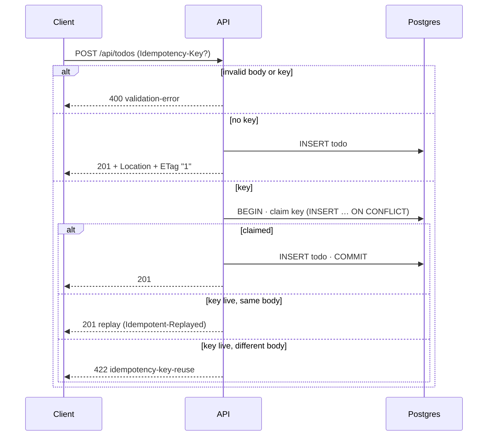
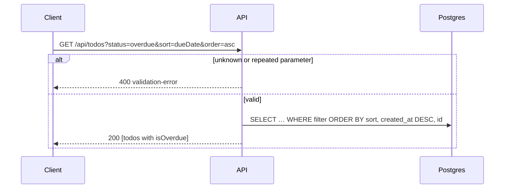
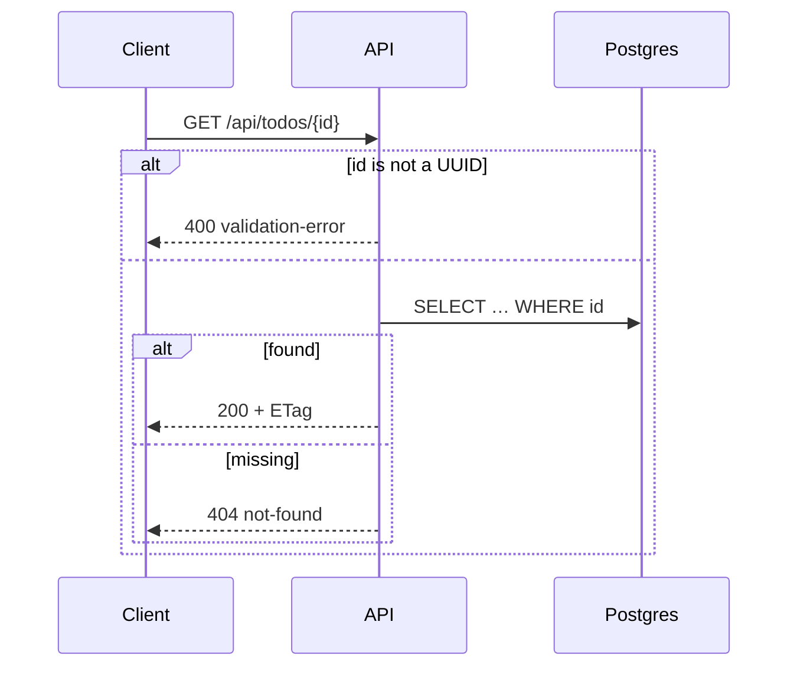
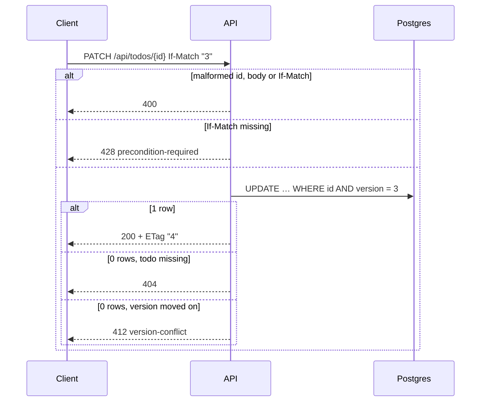
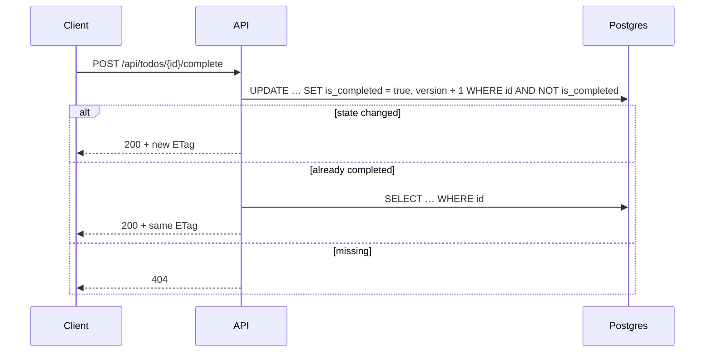
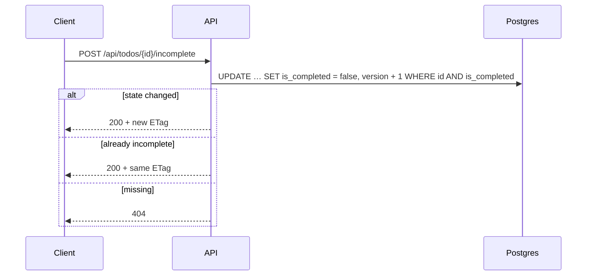
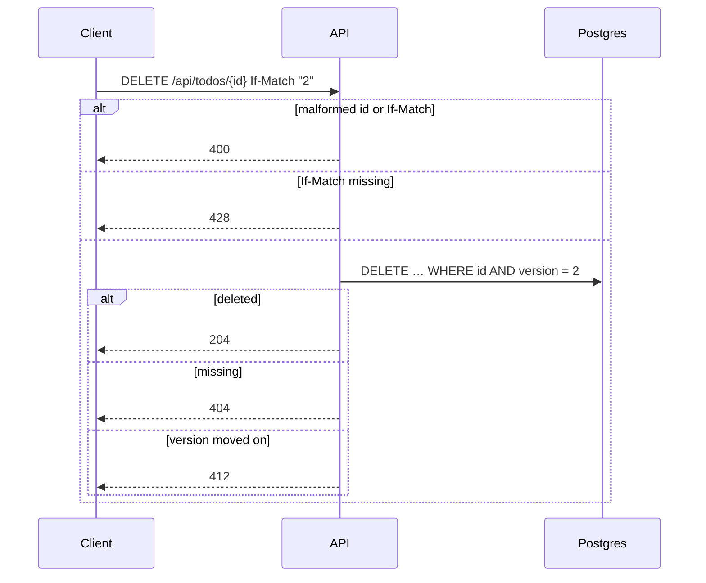

# API

Base path `/api`. JSON in and out; errors are `application/problem+json` ([RFC 9457](https://www.rfc-editor.org/rfc/rfc9457)). The interactive explorer is at **http://localhost:8080/api/docs** and the machine-readable contract at `/api/openapi.json` (generated from the same Zod schemas the API validates with).

## Conventions

| Topic                 | Rule                                                                                                                                                        |
| --------------------- | ----------------------------------------------------------------------------------------------------------------------------------------------------------- |
| Versions              | Every todo has a `version`; responses carry it as a strong `ETag` (e.g. `"3"`)                                                                              |
| Updates and deletes   | `If-Match: "<version>"` is required: missing → **428**, stale → **412**                                                                                     |
| Creates               | Optional `Idempotency-Key`; a repeat replays the original 201 with `Idempotent-Replayed: true`; same key + different body → **422**; keys expire after 24 h |
| Complete / incomplete | Idempotent; no `If-Match`; the version changes only if the state changes                                                                                    |
| Validation            | Bodies and queries are strict: unknown fields → **400** with per-field `errors`                                                                             |
| Error precedence      | **400** (malformed) → **428** (missing If-Match) → **404** → **412**                                                                                        |

## Endpoints

| Method | Path                           | Success                   | Errors                       |
| ------ | ------------------------------ | ------------------------- | ---------------------------- |
| POST   | `/api/todos`                   | 201 + `Location` + `ETag` | 400, 413, 415, 422           |
| GET    | `/api/todos?status&sort&order` | 200                       | 400                          |
| GET    | `/api/todos/{id}`              | 200 + `ETag`              | 400, 404                     |
| PATCH  | `/api/todos/{id}`              | 200 + `ETag`              | 400, 404, 412, 413, 415, 428 |
| POST   | `/api/todos/{id}/complete`     | 200 + `ETag`              | 400, 404                     |
| POST   | `/api/todos/{id}/incomplete`   | 200 + `ETag`              | 400, 404                     |
| DELETE | `/api/todos/{id}`              | 204                       | 400, 404, 412, 428           |
| GET    | `/api/health`                  | 200                       | 503                          |

List parameters: `status` = `all` (default) · `completed` · `incomplete` · `overdue`; `sort` = `createdAt` (default) · `dueDate` · `title`; `order` = `desc` (default) · `asc`. Todos without a due date sort last; ties break by newest, then id.

## Problem types

| `type`                            | Status | When                                                        |
| --------------------------------- | ------ | ----------------------------------------------------------- |
| `/problems/validation-error`      | 400    | Invalid body, query, id or header (`errors[]` lists fields) |
| `/problems/malformed-json`        | 400    | Body is not valid JSON                                      |
| `/problems/bad-request`           | 4xx    | Other client errors from the JSON parser (e.g. 415 charset) |
| `/problems/not-found`             | 404    | Unknown todo or route                                       |
| `/problems/version-conflict`      | 412    | `If-Match` is stale                                         |
| `/problems/payload-too-large`     | 413    | Body over 16 kB                                             |
| `/problems/idempotency-key-reuse` | 422    | Key reused with a different body                            |
| `/problems/precondition-required` | 428    | `If-Match` missing                                          |
| `/problems/internal`              | 500    | Unexpected error (details logged, never returned)           |

## Sequences

### Create — `POST /api/todos`

```bash
curl -i -X POST localhost:8080/api/todos -H 'Content-Type: application/json' \
  -H 'Idempotency-Key: 7d1c…' -d '{"title":"Buy milk","dueDate":"2026-10-01"}'
```



### List — `GET /api/todos`



### View — `GET /api/todos/{id}`



### Update — `PATCH /api/todos/{id}`

```bash
curl -i -X PATCH localhost:8080/api/todos/<id> -H 'If-Match: "1"' \
  -H 'Content-Type: application/json' -d '{"title":"Buy oat milk"}'
```



### Complete — `POST /api/todos/{id}/complete`



### Incomplete — `POST /api/todos/{id}/incomplete`



### Delete — `DELETE /api/todos/{id}`


