# Architecture

FociToDo is an npm-workspaces monorepo with four packages and one rule: **dependencies point inward**.

| Package             | Role                                                                                                                   |
| ------------------- | ---------------------------------------------------------------------------------------------------------------------- |
| `packages/shared`   | The contract: Zod schemas and types used by the API (validation, OpenAPI) and the web app (forms, response validation) |
| `packages/diagrams` | Dev-only tool: extracts Mermaid diagrams from Markdown and generates `docs/diagrams/`                                  |
| `apps/api`          | Express API: `http → service → domain`, storage behind ports                                                           |
| `apps/web`          | React single-page app; only `src/api/todoClient.ts` talks HTTP                                                         |

## System context


Mermaid source

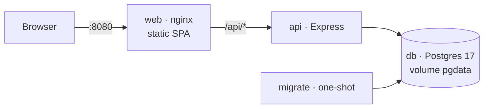

nginx serves the SPA and proxies `/api/*` unchanged, so the browser sees a single origin (no CORS). Only `web` publishes a port.

## Deployment and startup order


Mermaid source

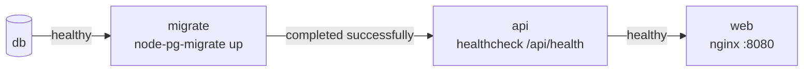

- `migrate` runs the SQL migrations once and exits; the API never changes the schema at runtime.
- A failed migration stops startup cleanly instead of crash-looping the API.
- Runtime images are non-root, contain compiled JavaScript and production dependencies only; the API container is read-only.

## Backend layers


Mermaid source

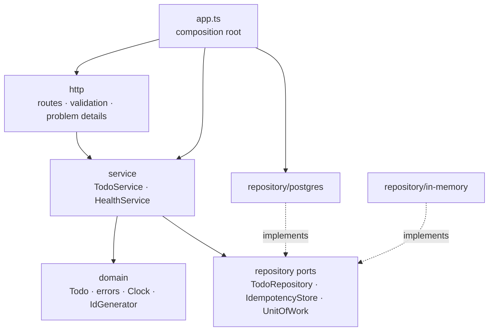

| Layer          | May import                             | Must not import                            |
| -------------- | -------------------------------------- | ------------------------------------------ |
| `domain`       | itself, `@foci/shared` types           | service, repository, http, `pg`, `express` |
| `service`      | domain, repository **ports**           | adapters, http, `pg`, `express`            |
| `repository/*` | domain, ports, `pg` (postgres only)    | service, http                              |
| `http`         | service, domain errors, `@foci/shared` | adapters, `pg`                             |
| `app.ts`       | everything                             | —                                          |

These rules are ESLint errors (`import-x/no-restricted-paths`), so a violation fails the build.

**Composition root.** `apps/api/src/app.ts` is the only place that picks implementations: it creates the pool, the Postgres adapters, the services and the Express app, passing dependencies through constructors. Tests use the same function with a fixed clock and predictable ids.

## Domain model


Mermaid source

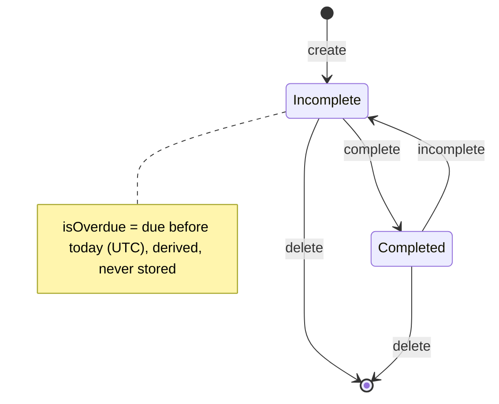

Every change increments `version`; completing an already-completed todo changes nothing.

## Data model


Mermaid source

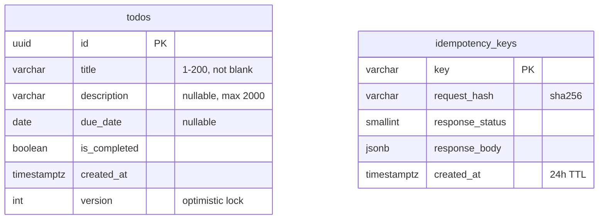

`CHECK` constraints repeat the key validation rules, so bad data cannot enter even if application code is bypassed.

## Frontend


Mermaid source

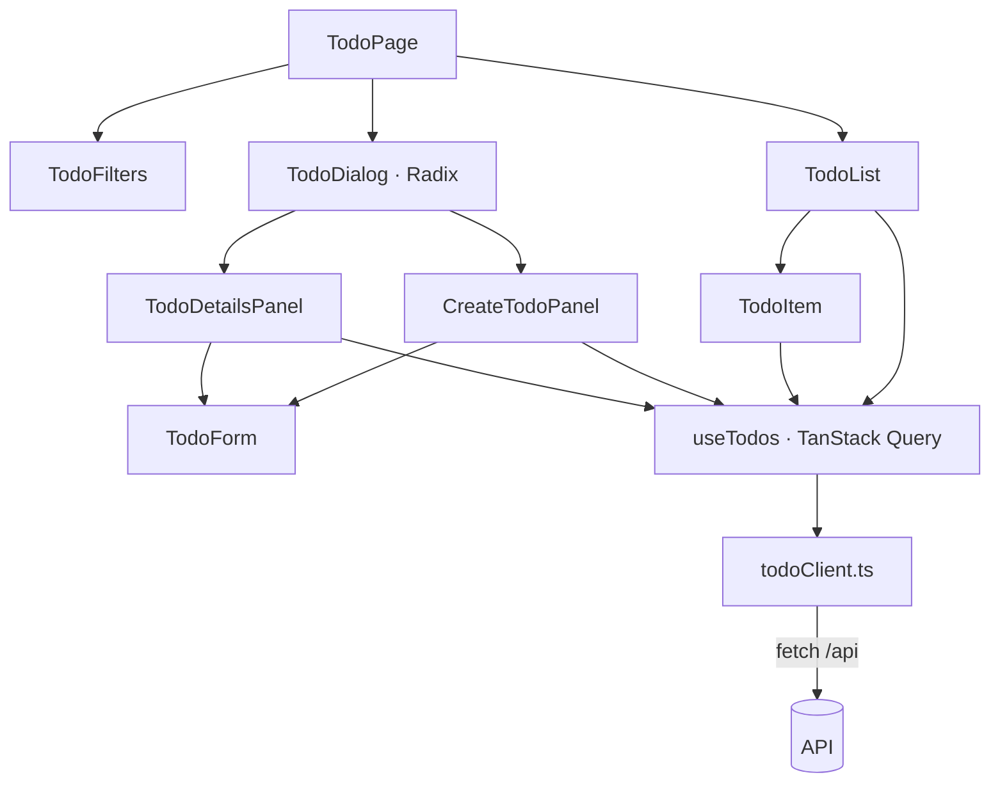

- Server state lives in TanStack Query; every mutation invalidates the todo queries when it settles.
- The panels know nothing about the dialog, so the dialog could be replaced by an inline panel without changing them.
- Due dates are rendered as stored strings (never through `Date`), so they cannot shift across timezones.

## Cross-cutting

- **Configuration:** environment variables validated with Zod at startup; invalid config stops the process with a clear message.
- **Errors:** domain errors are HTTP-agnostic; `http/problems.ts` is the single mapping to RFC 9457 problem details.
- **Logging:** pino JSON logs with a request id; 5xx errors are logged, never leaked to clients.
- **Shutdown:** `SIGTERM` stops accepting connections, drains requests and closes the pool.
