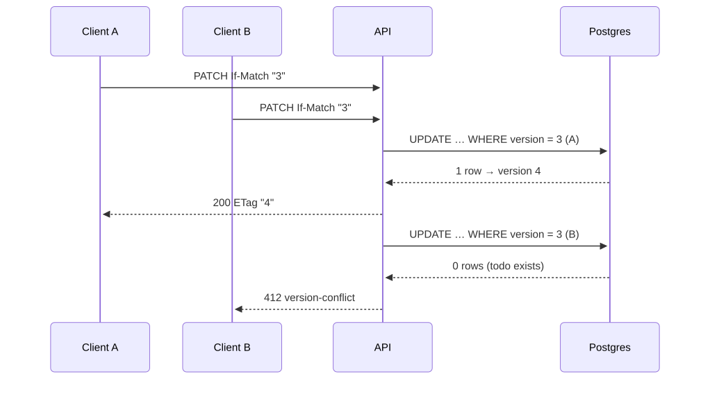
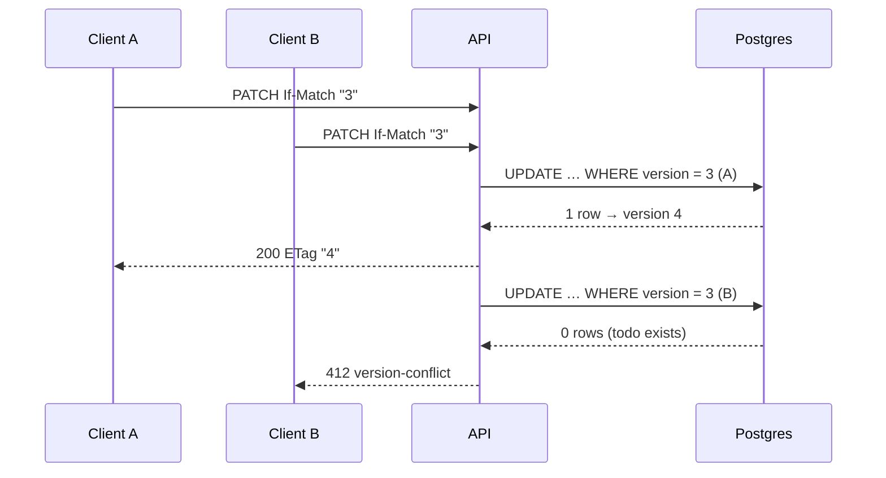
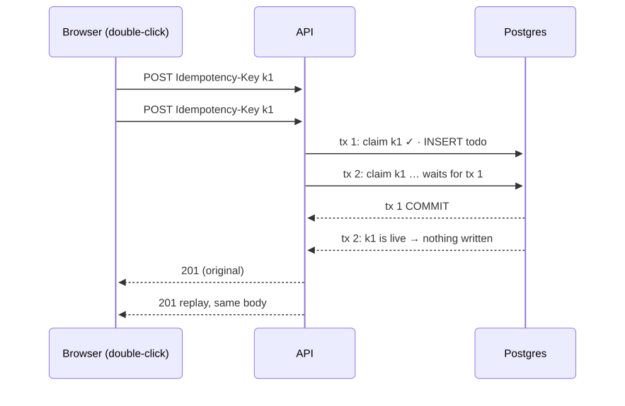
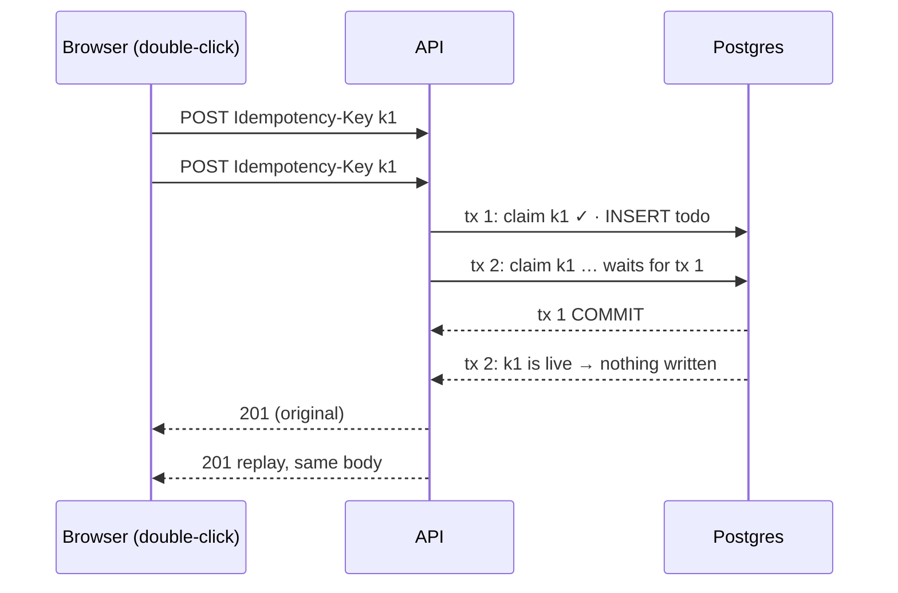
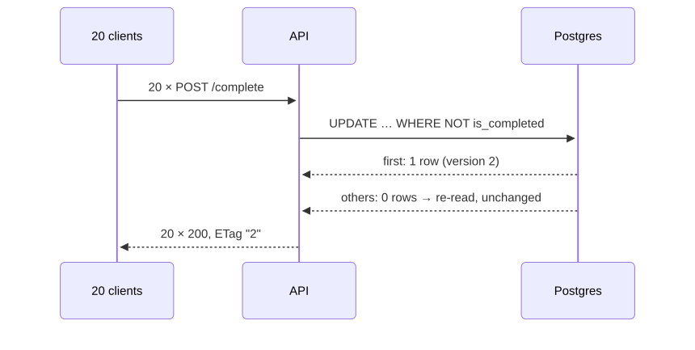
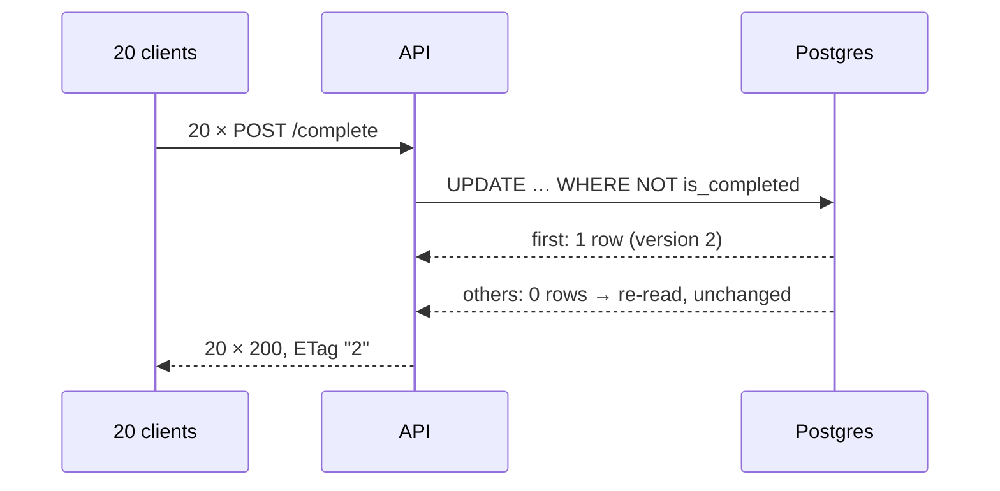

# Concurrency

Every guarantee below is enforced by the database, not by timing, and is proven by tests that fire parallel requests at a real server and Postgres, five rounds each, asserting final-state invariants (`apps/api/tests/http/todoRoutes.concurrency.test.ts`).

| Guarantee                  | Mechanism                                                                          | Proof                                                                                 |
| -------------------------- | ---------------------------------------------------------------------------------- | ------------------------------------------------------------------------------------- |
| Atomic writes              | Each write is one SQL statement; idempotent create is one transaction              | 50 parallel creates → exactly 50 rows, 50 unique ids                                  |
| No lost updates            | `version` column; `ETag` / required `If-Match`; `UPDATE … WHERE version = $n`      | Two PATCHes from version 1 → exactly one 200 and one 412; final state is the winner's |
| Idempotent status changes  | `UPDATE … WHERE is_completed <> $2`; version bumps only on change                  | 20 parallel completes → all 200, version +1 once                                      |
| Idempotent create          | Claim the key first in a transaction; the primary key serialises concurrent claims | 5 parallel POSTs with one key → 1 row, 5 identical 201 bodies; different body → 422   |
| Deterministic delete races | `DELETE … WHERE version = $n`, then re-check existence                             | 10 parallel deletes → one 204, nine 404                                               |
| Mixed contention           | All of the above                                                                   | 10 PATCHes + 5 completes → final version = 1 + successful mutations                   |

## Lost update, prevented

Mermaid source

The web app sends the version the user started from — the one the edit form opened on, or the one on screen when Delete was clicked — so a background refetch can never turn a stale edit into a silent overwrite. It reacts to a 412 by showing a notice, reloading the todo and keeping the user's edits; saving again then targets the reloaded version.

## Double submit, absorbed

Mermaid source

The web form generates one key per submission attempt and reuses it when the same payload is retried.

## Parallel completes, one change

Mermaid source

## What is not guaranteed

- A replayed create returns the **original** response snapshot, even if the todo was edited or deleted since (standard idempotency-key semantics).
- Complete/incomplete do not take `If-Match`: setting a target state cannot lose an update, but it does change the version, so a pending edit based on the old version gets a 412.
- `isOverdue` and `isDueSoon` are derived from the server clock when a response is built, so a replayed create or a list fetched earlier shows them as of that moment.
- Conditional GET: `If-None-Match` is ignored and responses are `no-store`, because `isOverdue`/`isDueSoon` change with the clock without a version bump; the ETag only guards writes.
