# PR 10 — Documentation

> Read `00-index.md` first. Branch: `docs/documentation`.

**Delivers:** the reviewer-facing README, the engineering guides (`docs/architecture.md`, `docs/api.md`, `docs/concurrency.md`, `docs/testing.md`) with every Mermaid diagram from the spec, the 14 ADRs, and a screenshot. Every diagram is validated by rendering it with the Mermaid CLI in Docker.

**Spec sections:** §10, D-2 – D-6, NFR-9.

**Writing rules for this PR:** short sentences; every diagram ≤ ~15 lines and next to the text it explains; no mention of hours, time spent, or scope tiers; commands copied exactly from the spec/index; links relative.

---

### Task 1: Engineering guides

**Files:**
- Create: `docs/architecture.md`, `docs/api.md`, `docs/concurrency.md`, `docs/testing.md`

- [ ] **Step 1: Write `docs/architecture.md`**

````markdown
# Architecture

FociToDo is an npm-workspaces monorepo with three packages and one rule: **dependencies point inward**.

| Package | Role |
|---|---|
| `packages/shared` | The contract: Zod schemas and types used by the API (validation, OpenAPI) and the web app (forms, response validation) |
| `apps/api` | Express API: `http → service → domain`, storage behind ports |
| `apps/web` | React single-page app; only `src/api/todoClient.ts` talks HTTP |

## System context

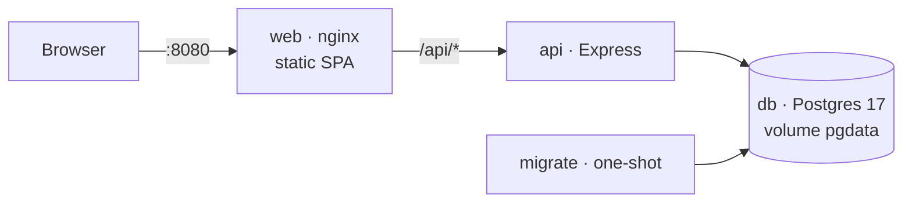

nginx serves the SPA and proxies `/api/*` unchanged, so the browser sees a single origin (no CORS). Only `web` publishes a port.

## Deployment and startup order

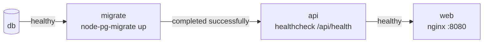

- `migrate` runs the SQL migrations once and exits; the API never changes the schema at runtime.
- A failed migration stops startup cleanly instead of crash-looping the API.
- Runtime images are non-root, contain compiled JavaScript and production dependencies only; the API container is read-only.

## Backend layers

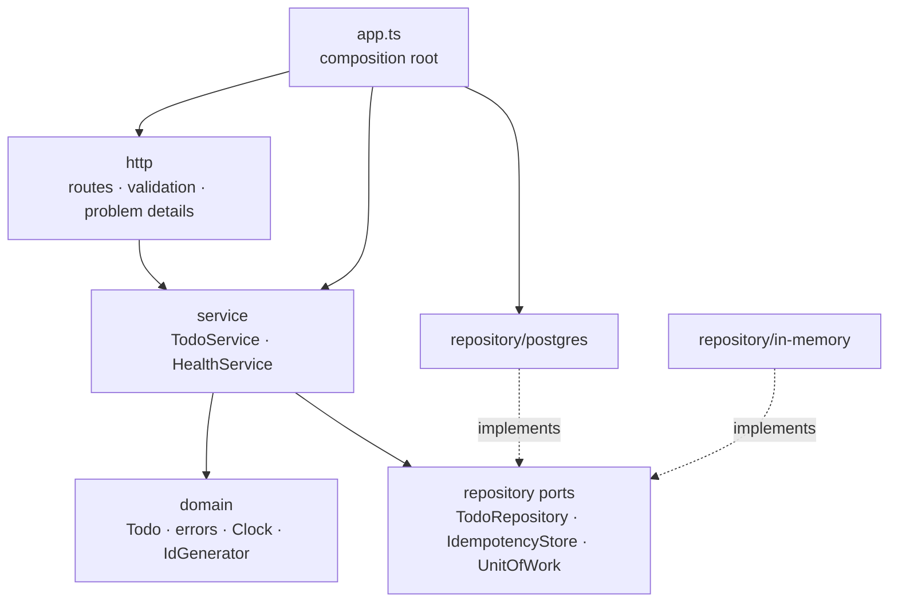

| Layer | May import | Must not import |
|---|---|---|
| `domain` | itself, `@foci/shared` types | service, repository, http, `pg`, `express` |
| `service` | domain, repository **ports** | adapters, http, `pg`, `express` |
| `repository/*` | domain, ports, `pg` (postgres only) | service, http |
| `http` | service, domain errors, `@foci/shared` | adapters, `pg` |
| `app.ts` | everything | — |

These rules are ESLint errors (`import-x/no-restricted-paths`), so a violation fails the build.

**Composition root.** `apps/api/src/app.ts` is the only place that picks implementations: it creates the pool, the Postgres adapters, the services and the Express app, passing dependencies through constructors. Tests use the same function with a fixed clock and predictable ids.

## Domain model

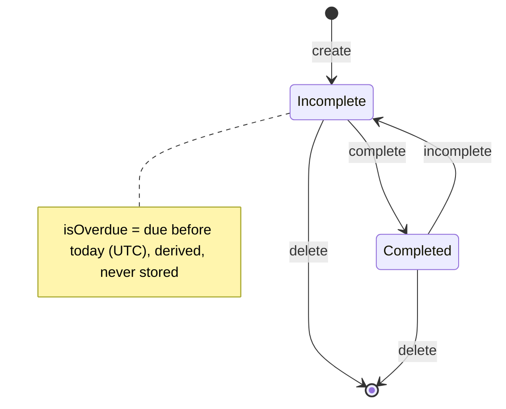

Every change increments `version`; completing an already-completed todo changes nothing.

## Data model

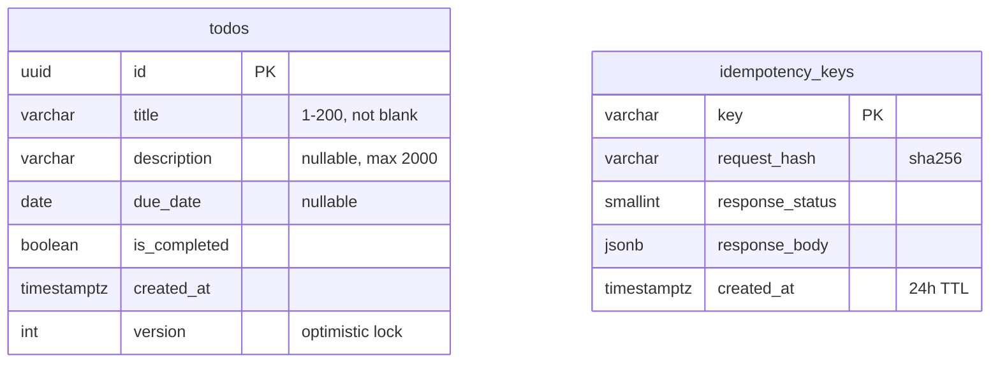

`CHECK` constraints repeat the key validation rules, so bad data cannot enter even if application code is bypassed.

## Frontend

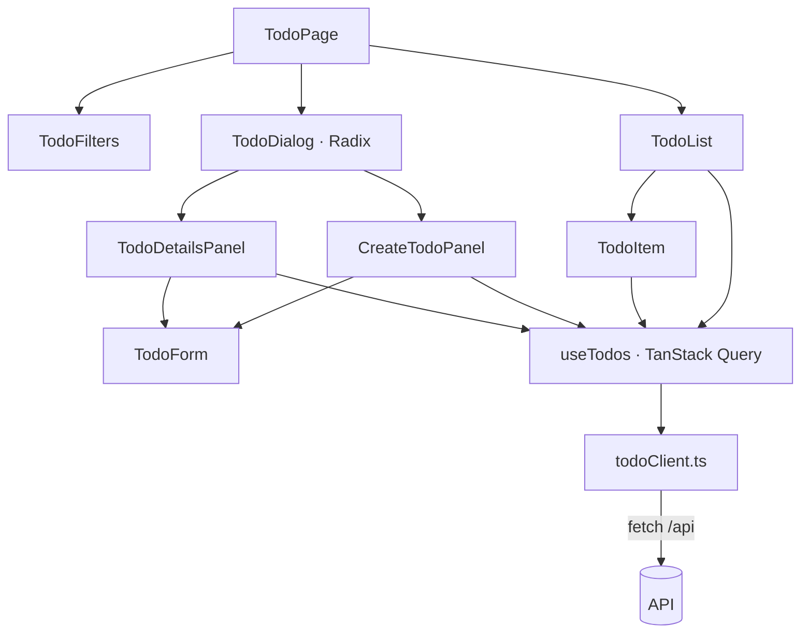

- Server state lives in TanStack Query; every mutation invalidates the todo queries when it settles.
- The panels know nothing about the dialog, so the dialog could be replaced by an inline panel without changing them.
- Due dates are rendered as stored strings (never through `Date`), so they cannot shift across timezones.

## Cross-cutting

- **Configuration:** environment variables validated with Zod at startup; invalid config stops the process with a clear message.
- **Errors:** domain errors are HTTP-agnostic; `http/problems.ts` is the single mapping to RFC 9457 problem details.
- **Logging:** pino JSON logs with a request id; 5xx errors are logged, never leaked to clients.
- **Shutdown:** `SIGTERM` stops accepting connections, drains requests and closes the pool.
````

- [ ] **Step 2: Write `docs/api.md`**

````markdown
# API

Base path `/api`. JSON in and out; errors are `application/problem+json` ([RFC 9457](https://www.rfc-editor.org/rfc/rfc9457)). The interactive explorer is at **http://localhost:8080/api/docs** and the machine-readable contract at `/api/openapi.json` (generated from the same Zod schemas the API validates with).

## Conventions

| Topic | Rule |
|---|---|
| Versions | Every todo has a `version`; responses carry it as a strong `ETag` (e.g. `"3"`) |
| Updates and deletes | `If-Match: "<version>"` is required: missing → **428**, stale → **412** |
| Creates | Optional `Idempotency-Key`; a repeat replays the original 201 with `Idempotent-Replayed: true`; same key + different body → **422**; keys expire after 24 h |
| Complete / incomplete | Idempotent; no `If-Match`; the version changes only if the state changes |
| Validation | Bodies and queries are strict: unknown fields → **400** with per-field `errors` |
| Error precedence | **400** (malformed) → **428** (missing If-Match) → **404** → **412** |

## Endpoints

| Method | Path | Success | Errors |
|---|---|---|---|
| POST | `/api/todos` | 201 + `Location` + `ETag` | 400, 413, 415, 422 |
| GET | `/api/todos?status&sort&order` | 200 | 400 |
| GET | `/api/todos/{id}` | 200 + `ETag` | 400, 404 |
| PATCH | `/api/todos/{id}` | 200 + `ETag` | 400, 404, 412, 413, 428 |
| POST | `/api/todos/{id}/complete` | 200 + `ETag` | 400, 404 |
| POST | `/api/todos/{id}/incomplete` | 200 + `ETag` | 400, 404 |
| DELETE | `/api/todos/{id}` | 204 | 400, 404, 412, 428 |
| GET | `/api/health` | 200 | 503 |

List parameters: `status` = `all` (default) · `completed` · `incomplete` · `overdue`; `sort` = `createdAt` (default) · `dueDate` · `title`; `order` = `desc` (default) · `asc`. Todos without a due date sort last; ties break by newest, then id.

## Problem types

| `type` | Status | When |
|---|---|---|
| `/problems/validation-error` | 400 | Invalid body, query, id or header (`errors[]` lists fields) |
| `/problems/malformed-json` | 400 | Body is not valid JSON |
| `/problems/bad-request` | 4xx | Other client errors from the JSON parser (e.g. 415 charset) |
| `/problems/not-found` | 404 | Unknown todo or route |
| `/problems/version-conflict` | 412 | `If-Match` is stale |
| `/problems/payload-too-large` | 413 | Body over 16 kB |
| `/problems/idempotency-key-reuse` | 422 | Key reused with a different body |
| `/problems/precondition-required` | 428 | `If-Match` missing |
| `/problems/internal` | 500 | Unexpected error (details logged, never returned) |

## Sequences

### Create — `POST /api/todos`

```bash
curl -i -X POST localhost:8080/api/todos -H 'Content-Type: application/json' \
  -H 'Idempotency-Key: 7d1c…' -d '{"title":"Buy milk","dueDate":"2026-10-01"}'
```

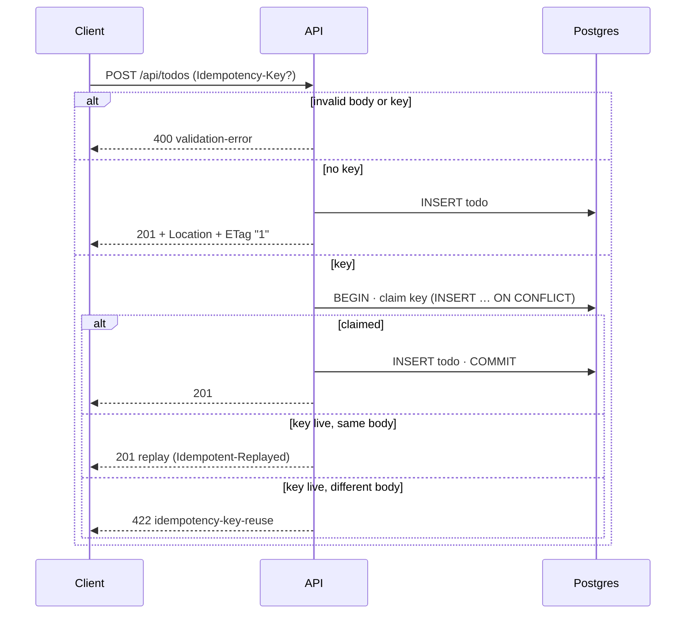

### List — `GET /api/todos`

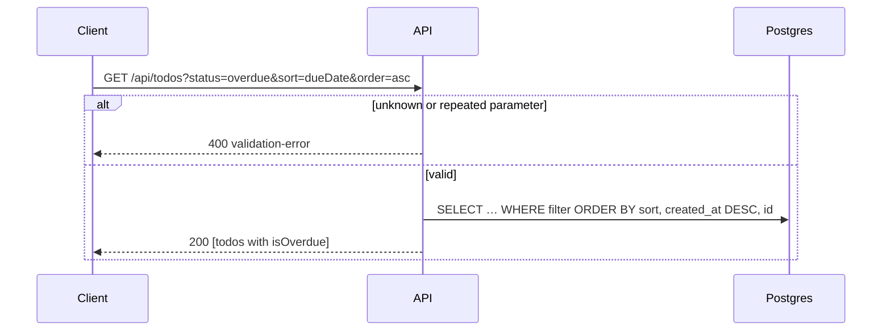

### View — `GET /api/todos/{id}`

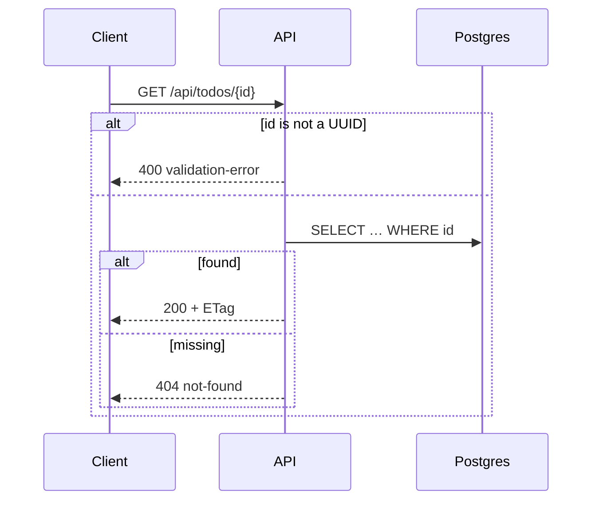

### Update — `PATCH /api/todos/{id}`

```bash
curl -i -X PATCH localhost:8080/api/todos/<id> -H 'If-Match: "1"' \
  -H 'Content-Type: application/json' -d '{"title":"Buy oat milk"}'
```

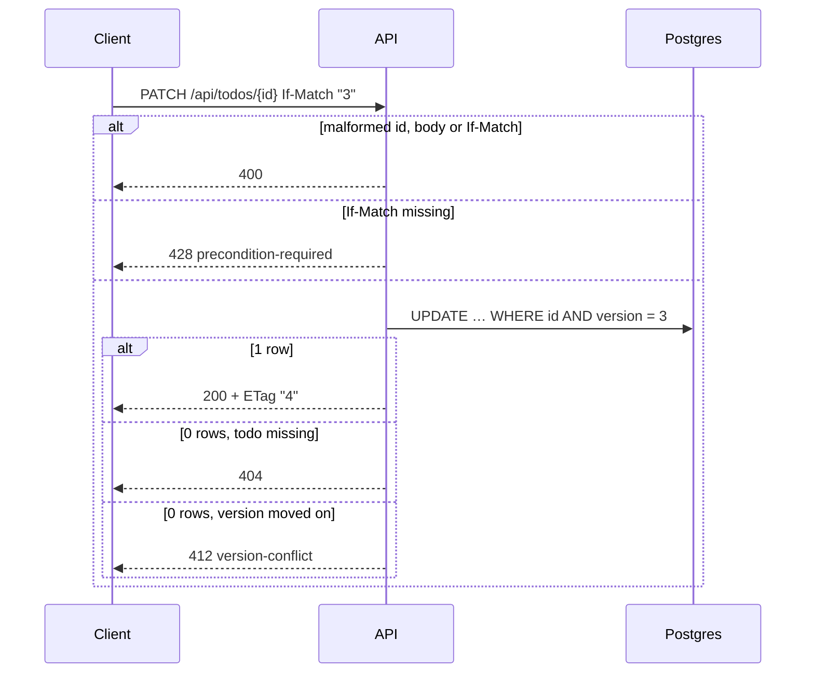

### Complete — `POST /api/todos/{id}/complete`

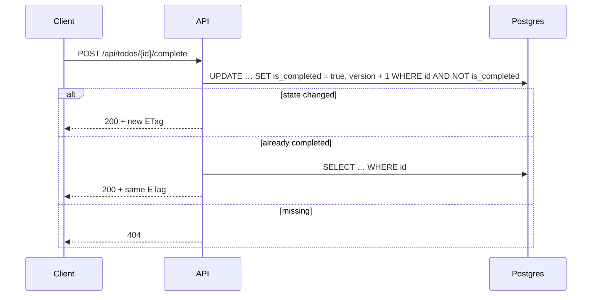

### Incomplete — `POST /api/todos/{id}/incomplete`

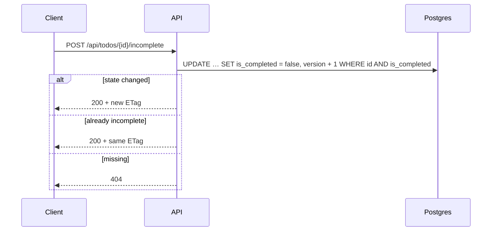

### Delete — `DELETE /api/todos/{id}`

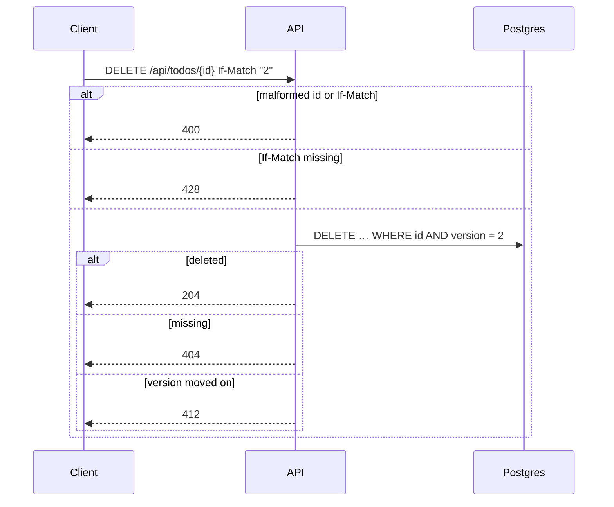
````

- [ ] **Step 3: Write `docs/concurrency.md`**

````markdown
# Concurrency

Every guarantee below is enforced by the database, not by timing, and is proven by tests that fire parallel requests at a real server and Postgres, five rounds each, asserting final-state invariants (`apps/api/tests/http/todoRoutes.concurrency.test.ts`).

| Guarantee | Mechanism | Proof |
|---|---|---|
| Atomic writes | Each write is one SQL statement; idempotent create is one transaction | 50 parallel creates → exactly 50 rows, 50 unique ids |
| No lost updates | `version` column; `ETag` / required `If-Match`; `UPDATE … WHERE version = $n` | Two PATCHes from version 1 → exactly one 200 and one 412; final state is the winner's |
| Idempotent status changes | `UPDATE … WHERE is_completed <> $2`; version bumps only on change | 20 parallel completes → all 200, version +1 once |
| Idempotent create | Claim the key first in a transaction; the primary key serialises concurrent claims | 5 parallel POSTs with one key → 1 row, 5 identical 201 bodies; different body → 422 |
| Deterministic delete races | `DELETE … WHERE version = $n`, then re-check existence | 10 parallel deletes → one 204, nine 404 |
| Mixed contention | All of the above | 10 PATCHes + 5 completes → final version = 1 + successful mutations |

## Lost update, prevented

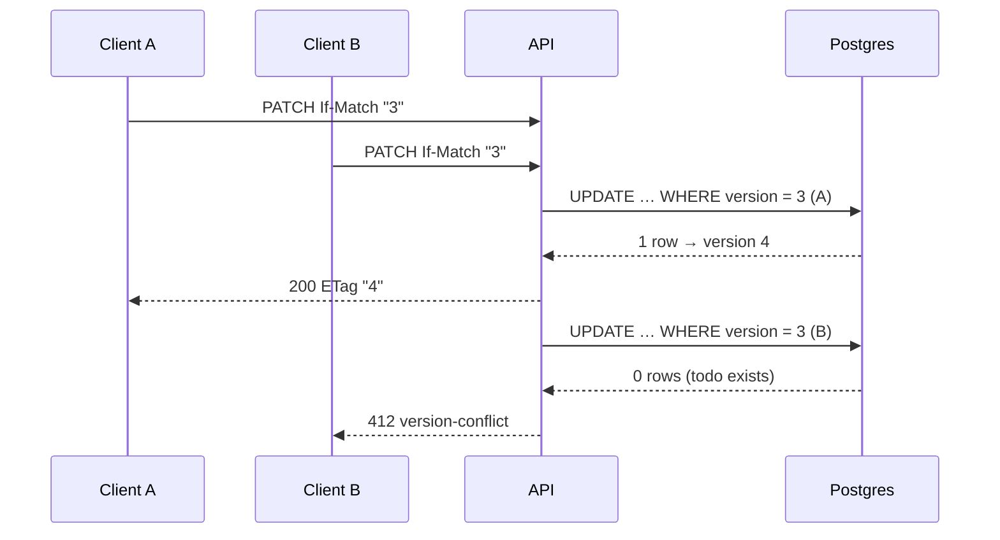

The web app reacts to a 412 by showing a notice, reloading the todo and keeping the user's edits so they can save again.

## Double submit, absorbed

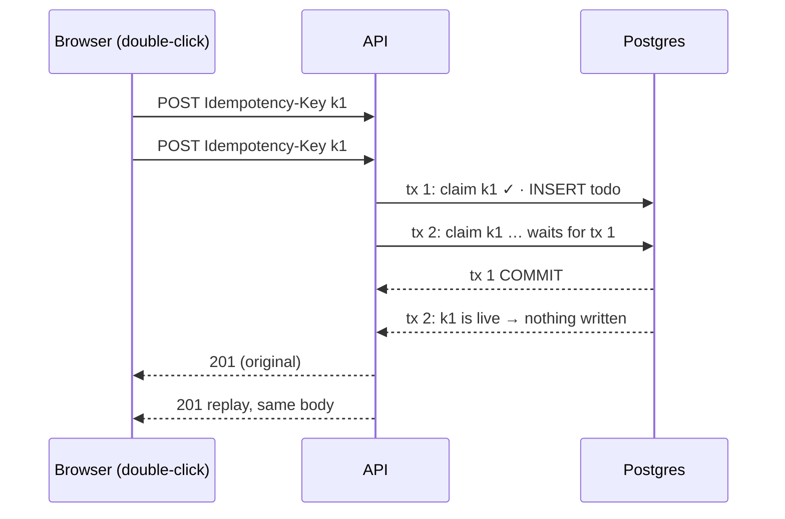

The web form generates one key per submission attempt and reuses it when the same payload is retried.

## Parallel completes, one change

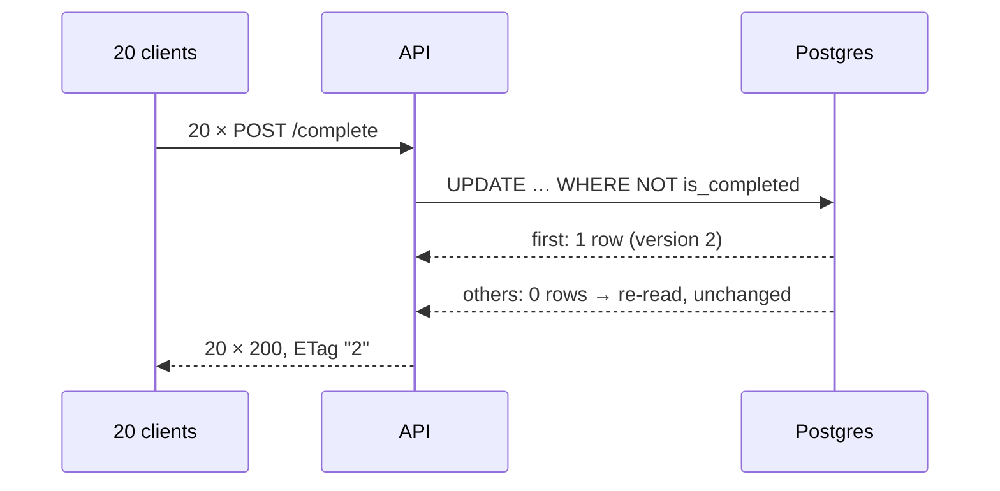

## What is not guaranteed

- A replayed create returns the **original** response snapshot, even if the todo was edited or deleted since (standard idempotency-key semantics).
- Complete/incomplete do not take `If-Match`: setting a target state cannot lose an update, but it does change the version, so a pending edit based on the old version gets a 412.
- Overdue is computed against the server's UTC date; near midnight it can differ from the user's local date.
````

- [ ] **Step 4: Write `docs/testing.md`**

````markdown
# Testing

```bash
docker compose --profile test run --rm --build test   # format, lint, typecheck, all Vitest layers, 100% coverage
docker compose -p foci-e2e -f compose.yaml -f compose.e2e.yaml run --rm --build e2e   # Playwright
docker compose -p foci-e2e -f compose.yaml -f compose.e2e.yaml down -v
```

Reports: `reports/coverage/index.html`, `reports/e2e/index.html`.

## Layers

| Layer | Where | Runs against | Proves |
|---|---|---|---|
| Shared schema | `packages/shared/tests` | — | Every validation rule and boundary |
| Domain and service | `apps/api/tests/{domain,service}` | in-memory storage, fixed clock, sequential ids | Business rules, error selection, idempotency logic |
| Repository contract | `apps/api/tests/repository` | **both** adapters | Identical filtering, sorting, versioning, expiry and atomicity |
| HTTP integration | `apps/api/tests/http/*.int.test.ts` | Supertest → Postgres | Status codes, headers, problem details, error precedence, OpenAPI conformance |
| Concurrency | `apps/api/tests/http/*.concurrency.test.ts` | real server → Postgres | The invariants in [concurrency.md](./concurrency.md) |
| Web | `apps/web/tests` | jsdom, fake `TodoClient` | UI states, validation, conflicts, idempotency keys, dialog accessibility |
| End-to-end | `e2e/` | Playwright → nginx → API → Postgres | The deployed stack works as a whole |

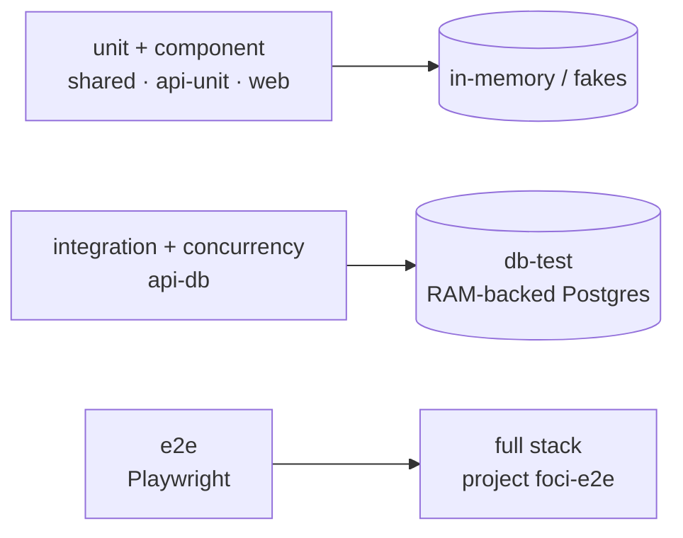

## Conventions

- **Mirrored paths:** `src/service/TodoService.ts` → `tests/service/TodoService.test.ts` in the same package.
- **Suffixes:** `.test.ts(x)` needs nothing; `.int.test.ts` and `.concurrency.test.ts` need Postgres and run in the `api-db` project, one file at a time, with tables truncated before each test. The harness refuses any database whose name does not end in `_test`.
- **Contract suite:** `tests/repository/repository.contract.ts` runs against the in-memory and Postgres adapters, so the fast unit tests rely on an in-memory adapter that provably behaves like Postgres.
- **Determinism:** clock, id generator and pool are injected; concurrency tests assert invariants, never timings.

## Coverage policy

- 100% lines, branches, functions and statements, merged across all Vitest projects, enforced by the test gate and CI.
- Excluded (no logic): `apps/api/src/server.ts` (process bootstrap), `apps/web/src/main.tsx` (React mount), `*.d.ts`.
- No `v8 ignore` comments. Hard-to-reach branches are made reachable by injecting the dependency instead.
- Coverage is a floor, not the goal: concurrency tests were checked by temporarily removing the version condition from the SQL (they fail), and e2e journeys by changing a UI message (they fail).

## Known edges

- Titles sort case-insensitively by code point (`lower(title) COLLATE "C"` with Postgres' built-in `C.UTF-8` locale; the in-memory adapter mirrors it). Rare characters whose lowercase form differs between JavaScript and Postgres' simple case mapping could order differently between the two adapters.
````

- [ ] **Step 5: Validate every diagram**

Run:
```bash
for f in docs/architecture.md docs/api.md docs/concurrency.md docs/testing.md; do
  docker run --rm -u "$(id -u):$(id -g)" -v "$PWD":/data minlag/mermaid-cli \
    -i "/data/$f" -o "/tmp/$(basename "$f")" >/dev/null && echo "OK $f" || echo "FAIL $f"
done
```
Expected: `OK` for all four files (the CLI renders each `mermaid` block and fails on syntax errors). Fix any diagram that fails before committing.

- [ ] **Step 6: Commit**

Run: `dev npx prettier --write docs/*.md` then `docker compose --profile test run --rm --build test`.
```bash
git add docs/architecture.md docs/api.md docs/concurrency.md docs/testing.md
git commit -F - <<'EOF'
docs: add architecture, API, concurrency and testing guides

Context, deployment, layer, state, ER and frontend diagrams; one
sequence diagram per endpoint with error branches; race-scenario
diagrams next to the tests that prove them.

Co-Authored-By: Claude Opus 5.5 <noreply@anthropic.com>
EOF
```

---

### Task 2: Architecture decision records

**Files:**
- Create: `docs/decisions/README.md`, `docs/decisions/0001-typescript-monorepo.md` … `docs/decisions/0014-curated-prs-and-ai-attribution.md`

Every ADR uses this shape (≈15 lines): `# NNNN Title`, `Status: Accepted · 2026-09-30`, `## Context`, `## Decision`, `## Consequences`, `## Alternatives considered`. Technical reasons only.

- [ ] **Step 1: Write the index**

`docs/decisions/README.md`:
```markdown
# Architecture decision records

| # | Decision |
|---|---|
| [0001](./0001-typescript-monorepo.md) | TypeScript monorepo with npm workspaces |
| [0002](./0002-postgres-with-plain-sql.md) | Postgres with `pg` and plain SQL |
| [0003](./0003-migrations-as-a-one-shot-service.md) | `node-pg-migrate` SQL migrations in a one-shot service |
| [0004](./0004-optimistic-locking-with-etags.md) | Optimistic locking with ETag / If-Match |
| [0005](./0005-idempotent-status-and-create.md) | Idempotent status actions and Idempotency-Key on create |
| [0006](./0006-patch-plus-action-routes.md) | PATCH plus action routes |
| [0007](./0007-problem-details.md) | RFC 9457 problem details |
| [0008](./0008-server-side-utc-overdue.md) | Overdue computed server-side in UTC |
| [0009](./0009-openapi-from-zod.md) | OpenAPI generated from Zod |
| [0010](./0010-single-page-ui-with-dialog.md) | Single-page UI with a Radix dialog and TanStack Query |
| [0011](./0011-in-app-developer-portal.md) | In-app `/dev` portal single-sourced from `docs/` |
| [0012](./0012-docker-only-setup.md) | One multi-stage Dockerfile, Compose profiles, Docker-only setup |
| [0013](./0013-test-strategy-and-coverage-gate.md) | Test strategy and 100% coverage gate |
| [0014](./0014-curated-prs-and-ai-attribution.md) | Curated PR workflow and AI attribution |
```

- [ ] **Step 2: Write the ADRs**

`docs/decisions/0001-typescript-monorepo.md`:
```markdown
# 0001 TypeScript monorepo with npm workspaces

Status: Accepted · 2026-09-30

## Context
The API and the web app must agree on validation rules and data shapes; drift between them is a common source of bugs.

## Decision
One repository with three workspaces: `@foci/shared` (Zod schemas and types), `@foci/api`, `@foci/web`. Plain TypeScript style: classes, interfaces, constructor injection, no DI container.

## Consequences
+ One contract, enforced by the compiler on both sides; one install, one test command.
− Workspace-aware Docker builds and a little TypeScript configuration (`@foci/source` export condition).

## Alternatives considered
Separate repositories (types duplicated or published), a single package (no enforced boundaries), Python/FastAPI backend (two languages, duplicated rules).
```

`docs/decisions/0002-postgres-with-plain-sql.md`:
```markdown
# 0002 Postgres with `pg` and plain SQL

Status: Accepted · 2026-09-30

## Context
Data must persist and concurrent writes must be safe. The brief allows a file store, but files need hand-written locking.

## Decision
Postgres 17 behind repository ports, accessed with the `pg` driver and hand-written parameterised SQL. An in-memory adapter implements the same ports for fast tests.

## Consequences
+ Transactions, row-level atomicity and constraints for free; every query is visible and reviewable.
− One more container; row mapping written by hand.

## Alternatives considered
JSON file (custom locking), SQLite (weaker concurrency story, native module), Prisma/Drizzle (hide the SQL that carries the concurrency guarantees).
```

`docs/decisions/0003-migrations-as-a-one-shot-service.md`:
```markdown
# 0003 `node-pg-migrate` SQL migrations in a one-shot service

Status: Accepted · 2026-09-30

## Context
The schema must exist before the API serves requests, and scaling the API must not race on migrations.

## Decision
Plain `.sql` migrations applied by `node-pg-migrate` (advisory-locked) from a dedicated `migrate` Compose service; the API starts only after it completes successfully. Tests apply the same migrations to the test database.

## Consequences
+ Migrations run exactly once; a failed migration stops startup cleanly; the API needs no DDL rights at runtime.
− One more service in Compose.

## Alternatives considered
Migrate on API boot (races when scaled, crash loops), a home-made runner (custom concurrency-sensitive code).
```

`docs/decisions/0004-optimistic-locking-with-etags.md`:
```markdown
# 0004 Optimistic locking with ETag / If-Match

Status: Accepted · 2026-09-30

## Context
Two clients editing the same todo can silently overwrite each other (lost update).

## Decision
A `version` column, exposed as a strong `ETag` and in the body. PATCH and DELETE require `If-Match`; writes are conditional (`WHERE version = $n`). Missing → 428, stale → 412.

## Consequences
+ Lost updates are impossible; standard HTTP semantics; testable as an invariant.
− Clients must track the ETag; the UI handles 412 by reloading and keeping the user's edits.

## Alternatives considered
Version in the body with 409 (non-standard), last-write-wins (loses data), pessimistic locks (hold connections across requests).
```

`docs/decisions/0005-idempotent-status-and-create.md`:
```markdown
# 0005 Idempotent status actions and Idempotency-Key on create

Status: Accepted · 2026-09-30

## Context
Double-clicks and network retries repeat requests. Repeating "complete" is harmless; repeating "create" makes duplicates.

## Decision
Complete/incomplete set a target state and bump the version only when it changes. POST accepts an optional `Idempotency-Key`: the key is claimed first in the same transaction as the insert; repeats replay the stored 201; a different body with the same key is 422; keys expire after 24 h.

## Consequences
+ Retries are always safe; concurrent duplicates serialise on the key's primary key.
− An extra table and a replay-snapshot semantic to document.

## Alternatives considered
No protection on create (duplicates), client-generated ids (pushes the problem to clients).
```

`docs/decisions/0006-patch-plus-action-routes.md`:
```markdown
# 0006 PATCH plus action routes

Status: Accepted · 2026-09-30

## Context
The brief separates "update title/description/due date" from "complete" and "incomplete".

## Decision
`PATCH /todos/{id}` for partial edits (`null` clears optional fields; If-Match required) and `POST /todos/{id}/complete|incomplete` for status (idempotent, no If-Match).

## Consequences
+ Each operation maps one-to-one to the brief; versioning rules stay simple per route.
− Two extra routes instead of a generic PATCH of `isCompleted`.

## Alternatives considered
PUT full replacement (clients must resend everything), PATCH-only status changes (mixes idempotent and versioned semantics).
```

`docs/decisions/0007-problem-details.md`:
```markdown
# 0007 RFC 9457 problem details

Status: Accepted · 2026-09-30

## Context
Clients need one predictable error shape, including per-field validation errors.

## Decision
All errors are `application/problem+json` with `type`, `title`, `status`, `detail`, `instance` and, for validation, `errors: [{ field, message }]`. One module maps domain errors to problems; unexpected errors become a generic 500 that is logged but not leaked.

## Consequences
+ Self-describing errors; the web form maps `errors` straight onto fields.
− Problem type URIs to maintain.

## Alternatives considered
A custom `{ error: … }` envelope (non-standard, needs its own documentation).
```

`docs/decisions/0008-server-side-utc-overdue.md`:
```markdown
# 0008 Overdue computed server-side in UTC

Status: Accepted · 2026-09-30

## Context
"Overdue" is used both for filtering and for a badge; computing it in two places with two clocks would disagree.

## Decision
The API computes `isOverdue = !isCompleted && dueDate < today` with "today" taken from the injected clock in UTC, and returns it on every todo. The UI only displays it.

## Consequences
+ The filter and the badge always agree; deterministic tests via a fixed clock.
− Near midnight the UTC date can differ from the user's local date (documented assumption).

## Alternatives considered
Client-supplied `today` (more parameters and edge cases), computing in the browser (disagrees with the server filter).
```

`docs/decisions/0009-openapi-from-zod.md`:
```markdown
# 0009 OpenAPI generated from Zod

Status: Accepted · 2026-09-30

## Context
Reviewers and client teams expect a machine-readable API contract, and hand-written docs drift.

## Decision
Build an OpenAPI 3.1 document from the shared Zod schemas with Zod's built-in `z.toJSONSchema`, serve it at `/api/openapi.json` with Swagger UI at `/api/docs`, and commit a generated `openapi.json` guarded by a test.

## Consequences
+ One source of truth; tests prove every route is documented and every response status matches the document; reviewers can try the API in a browser.
− Route metadata (summaries, status lists) is still written by hand next to the routes.

## Alternatives considered
`@asteasolutions/zod-to-openapi` (cannot document schemas created before its Zod extension runs), a hand-written YAML (duplicates the rules), Markdown only (not machine-checkable).
```

`docs/decisions/0010-single-page-ui-with-dialog.md`:
```markdown
# 0010 Single-page UI with a Radix dialog and TanStack Query

Status: Accepted · 2026-09-30

## Context
The UI is not the focus of the evaluation but must cover every operation and handle the API's concurrency semantics correctly.

## Decision
One page (filters + list) with a Radix Dialog for create/view/edit/delete; server state in TanStack Query; plain CSS Modules. Panels are independent of the dialog so it can be swapped for an inline panel.

## Consequences
+ Accessible modal behaviour (focus trap, Escape, focus return) from a well-tested headless library; no hand-written fetch/effect race handling.
− Two UI dependencies.

## Alternatives considered
Multiple routes with React Router (more surface), a hand-rolled modal (accessibility risk), plain hooks with `useEffect` (stale-response races).
```

`docs/decisions/0011-in-app-developer-portal.md`:
```markdown
# 0011 In-app `/dev` portal single-sourced from `docs/`

Status: Accepted · 2026-09-30

## Context
Reviewers should be able to see the architecture and diagrams rendered while running the app, without GitHub.

## Decision
A lazily loaded `/dev` section of the React app renders the repository's Markdown (README, guides, ADRs) with `react-markdown` and `mermaid`, links to the API explorer and shows build information. Content is bundled from `docs/` at build time.

## Consequences
+ One copy of the docs; diagrams render in the product; the todo bundle stays small.
− The web image build includes `docs/`; the portal adds two dependencies to its own chunk.

## Alternatives considered
A separate static docs site (custom build tooling), links to GitHub only (needs internet, not rendered in the app).
```

`docs/decisions/0012-docker-only-setup.md`:
```markdown
# 0012 One multi-stage Dockerfile, Compose profiles, Docker-only setup

Status: Accepted · 2026-09-30

## Context
Reviewers must be able to run the app and every test without installing Node or Postgres, on any OS and CPU architecture.

## Decision
One root Dockerfile (one cached `npm ci`; targets `test`, `api`, `migrate`, `web`, `e2e`) and Compose with a default stack plus `test` and `dev` profiles and an e2e overlay run under its own project name. Pinned multi-arch base images; non-root runtimes.

## Consequences
+ Identical commands locally and in CI; tests use a throwaway RAM-backed Postgres; e2e never touches demo data.
− Long-ish Compose commands (documented verbatim).

## Alternatives considered
Per-app Dockerfiles (duplicated install stages), a Makefile (not available by default on Windows), Testcontainers (needs the Docker socket inside containers).
```

`docs/decisions/0013-test-strategy-and-coverage-gate.md`:
```markdown
# 0013 Test strategy and 100% coverage gate

Status: Accepted · 2026-09-30

## Context
Correctness and concurrency safety are the top priorities; coverage alone does not prove either.

## Decision
Seven layers (schema, service, repository contract on both adapters, HTTP, concurrency invariants, web components, e2e) with a merged 100% coverage gate. Dependencies (clock, ids, pool, HTTP client) are injected so every branch is reachable without coverage-ignore comments.

## Consequences
+ Every line runs under test; the contract suite keeps the fast in-memory tests honest; invariants catch races.
− More test code; logic-free bootstrap files are excluded explicitly.

## Alternatives considered
Tiered thresholds (allows untested branches), report-only coverage (no guarantee).
```

`docs/decisions/0014-curated-prs-and-ai-attribution.md`:
```markdown
# 0014 Curated PR workflow and AI attribution

Status: Accepted · 2026-09-30

## Context
The history should show how the work was done; AI assistance is used and should be transparent.

## Decision
One branch and PR per work package, merged with a merge commit after curating the branch into a few meaningful, green commits (fixups autosquashed). Conventional Commits. Every AI-assisted commit carries a `Co-Authored-By: Claude` trailer; decisions are recorded in these ADRs and the spec; milestone reviews live in a separate review repository.

## Consequences
+ A readable, bisectable history with visible review points; clear accountability.
− Some branch-tidying before each PR.

## Alternatives considered
Squash merges (lose the test-first steps), committing straight to `main` (no review points), no attribution (less transparent).
```

- [ ] **Step 3: Commit**

Run: `dev npx prettier --write docs/decisions`.
```bash
git add docs/decisions
git commit -F - <<'EOF'
docs(adr): record the architecture decisions

Co-Authored-By: Claude Opus 5.5 <noreply@anthropic.com>
EOF
```

---

### Task 3: README and screenshot

**Files:**
- Create: `README.md`, `docs/images/screenshot.png`

- [ ] **Step 1: Capture the screenshot**

Run:
```bash
docker compose up --build -d
until curl -sf http://localhost:8080/api/health >/dev/null; do sleep 1; done
curl -s -X POST localhost:8080/api/todos -H 'Content-Type: application/json' -d '{"title":"Buy oat milk","dueDate":"2030-01-15"}' >/dev/null
curl -s -X POST localhost:8080/api/todos -H 'Content-Type: application/json' -d '{"title":"File taxes","dueDate":"2026-04-30","description":"Receipts in the blue folder"}' >/dev/null
curl -s -X POST localhost:8080/api/todos -H 'Content-Type: application/json' -d '{"title":"Call the bank"}' >/dev/null
mkdir -p docs/images
docker run --rm --network foci-todo_default -v "$PWD/docs/images":/out mcr.microsoft.com/playwright:v1.63.0-noble \
  npx -y playwright@1.63.0 screenshot --viewport-size=1100,700 http://web:8080 /out/screenshot.png
docker compose down -v
```
Expected: `docs/images/screenshot.png` shows the list with an OVERDUE badge on "File taxes".

- [ ] **Step 2: Write the README**

`README.md`:
````markdown
# FociToDo

[](https://github.com/charlesmalo/FociToDo/actions/workflows/ci.yml)
[](https://github.com/charlesmalo/FociToDo/actions/workflows/ci.yml)

A to-do application — TypeScript, Express, Postgres and React — built to demonstrate clean architecture, correctness under concurrency and thorough automated testing. **Docker is the only prerequisite.**


## Quick start

Requires Docker Desktop (or Docker Engine) with Compose v2.24+.

```bash
git clone https://github.com/charlesmalo/FociToDo.git
cd FociToDo
docker compose up --build -d
```

| URL | What |
|---|---|
| http://localhost:8080 | The app |
| http://localhost:8080/api/docs | Interactive API explorer (OpenAPI) |

Port 8080 busy? Copy `.env.example` to `.env` and set `WEB_PORT`.
Stop with `docker compose down` (keeps data) or `docker compose down -v` (deletes data).

## Running the tests

```bash
docker compose --profile test run --rm --build test
```

Runs the format check, lint (including architecture-boundary rules), type checks, and every unit, integration, concurrency and component test against a throwaway RAM-backed Postgres, failing below **100% coverage**. Report: `reports/coverage/index.html`.

End-to-end (real browser against the full stack, isolated from your demo data):

```bash
docker compose -p foci-e2e -f compose.yaml -f compose.e2e.yaml run --rm --build e2e
docker compose -p foci-e2e -f compose.yaml -f compose.e2e.yaml down -v
```

Report: `reports/e2e/index.html`.

## Design overview

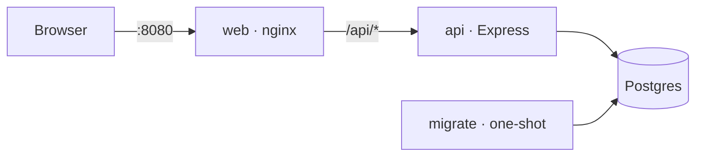

- **Monorepo:** `packages/shared` (Zod contract), `apps/api` (Express), `apps/web` (React). The shared schemas drive API validation, web forms and the OpenAPI document.
- **Backend layers:** `http → service → domain`, storage behind ports with Postgres and in-memory adapters, wired by hand in one composition root. Boundaries are lint-enforced.
- **Concurrency:** optimistic locking with `ETag`/`If-Match` (412 on conflict), idempotent complete/incomplete, and `Idempotency-Key` on create — all enforced in SQL.
- **Errors:** RFC 9457 problem details with per-field validation errors.
- **Why OpenAPI?** A standard, machine-readable contract generated from the same Zod schemas the API validates with, so docs can't drift; it gives reviewers an interactive page to try every endpoint at `/api/docs`.

More: [architecture](docs/architecture.md) · [API and sequence diagrams](docs/api.md) · [concurrency](docs/concurrency.md) · [testing](docs/testing.md) · [decision records](docs/decisions/README.md)

## Testing strategy

| Layer | Proves |
|---|---|
| Shared schema | Every validation rule and boundary |
| Domain + service | Business rules and error selection (in-memory storage, fixed clock) |
| Repository contract | In-memory and Postgres adapters behave identically |
| HTTP integration | Status codes, headers, problem details, OpenAPI conformance |
| Concurrency | Parallel requests never lose updates or create duplicates |
| Web components | UI states, validation, conflict and retry handling |
| End-to-end | The deployed stack works in a real browser |

Tests mirror source paths (`src/a/B.ts` → `tests/a/B.test.ts`). See [docs/testing.md](docs/testing.md).

## Assumptions

1. Single user; no authentication.
2. "Overdue" means incomplete with a due date before **today in UTC**; near midnight this can differ from the local date.
3. Past due dates are allowed (e.g. logging a late task).
4. Updates are partial (`PATCH`); `null` clears the description or due date; the title cannot be cleared.
5. Complete/incomplete are idempotent and do not require `If-Match`.
6. Delete is permanent.
7. No pagination; lists are expected to stay small.
8. Idempotency keys apply to creates only and expire after 24 hours; a replay returns the original response.
9. Timestamps are stored in UTC; the UI shows them in the viewer's locale. Due dates are calendar dates and never shift.
10. Titles sort case-insensitively; todos without a due date sort last.

## Trade-offs

- **Postgres over a file store:** one more container, in exchange for transactions and constraints that make the concurrency guarantees simple and verifiable.
- **Required `If-Match`:** clients must track ETags; in return lost updates are impossible.
- **Server-side UTC overdue:** consistent filtering and badges, at the cost of the midnight edge case above.
- **No pagination, auth, soft delete or `completedAt`:** not required by the brief; each would add API surface and tests without improving correctness.
- **Single page with a modal:** covers every operation with the least UI code; the panels are independent of the dialog if a different layout is preferred.

## How this was built

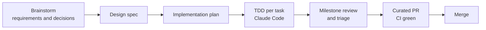

Built with Claude Code as a pair programmer under the rules in [CLAUDE.md](CLAUDE.md). Requirements, decisions and the plan are in [docs/superpowers](docs/superpowers); every architectural choice has an [ADR](docs/decisions/README.md). Each work package was reviewed before merging; review reports, the requirements traceability matrix and verification evidence live in the companion repository **[FociToDo-review](https://github.com/charlesmalo/FociToDo-review)**. AI-assisted commits carry a `Co-Authored-By` trailer.

## Project layout

```
packages/shared/   Zod contract (schemas, types, problem details)
apps/api/          Express API: domain · service · repository (postgres, in-memory) · http
apps/web/          React app: api client · todo feature · styles
e2e/               Playwright journeys
docs/              Guides, ADRs, spec and plan
Dockerfile         One multi-stage build: test · api · migrate · web · e2e
compose.yaml       Default stack + test/dev profiles; compose.e2e.yaml overlay
```
````

- [ ] **Step 3: Validate the README diagrams and links**

Run: `docker run --rm -u "$(id -u):$(id -g)" -v "$PWD":/data minlag/mermaid-cli -i /data/README.md -o /tmp/README.md >/dev/null && echo OK`
Expected: `OK`. Then check every relative link target exists: `grep -oE '\]\((docs|CLAUDE)[^)#]*' README.md | sed 's/](//' | xargs -I{} test -e {} && echo links-ok`.

- [ ] **Step 4: Gate and commit**

Run: `dev npx prettier --write README.md` then `docker compose --profile test run --rm --build test`.
```bash
git add README.md docs/images/screenshot.png
git commit -F - <<'EOF'
docs: add the README with quick start, testing, design and assumptions

Co-Authored-By: Claude Opus 5.5 <noreply@anthropic.com>
EOF
```

Then follow the per-PR procedure. PR title: `docs: README, guides and decision records`.
