# UI wireframes — Implementation Plan

> **For agentic workers:** REQUIRED SUB-SKILL: Use superpowers:subagent-driven-development (recommended) or superpowers:executing-plans to implement this plan task-by-task. Steps use checkbox (`- [ ]`) syntax for tracking.

**Goal:** `docs/ui.md` documents every screen state of the single-page UI as a Mermaid `block-beta` wireframe that flows through the existing diagram pipeline (SVG image, collapsed source, README map, gate, CI).

**Architecture:** Two small changes to `packages/diagrams` (`block-beta`/`block` → kind `wireframe`; `block.useMaxWidth: false`) and a new guide whose wireframes are ordinary Mermaid diagrams to the existing tooling.

**Tech Stack:** Mermaid 12 `block-beta` (rendered by `minlag/mermaid-cli:12.0.0`, pinned by digest), TypeScript, Vitest.

**Spec:** [2026-10-02-acceptance-storyboard-design.md](../../specs/2026-10-02-acceptance-storyboard-design.md) §2, §3 — with [00-index.md](00-index.md) (global constraints).

Branch: `docs/ui-wireframes` (exists; carries the spec and these plans).

## Global Constraints

See [00-index.md](00-index.md#global-constraints-both-plans). In addition:

- Wireframe ids are `ui/<slug>` of these exact headings (one wireframe each, in this order): `Task list — loading`, `Task list — empty`, `Task list — with tasks`, `Task list — no match`, `Task list — load error`, `Filters and sorting`, `Dialog — new task`, `Dialog — new task with errors`, `Dialog — task details`, `Dialog — edit task`, `Dialog — delete confirmation`, `Dialog — changed elsewhere`, `Dialog — task no longer exists`.
- Visible strings in wireframes are the UI's real strings (verified below against `apps/web/src/todos/components/*.tsx` at plan time).
- Diagram total after this plan: 32 (19 existing + 13).

## Review Focus

1. A `block-beta` label containing `<br/>` must render as a line break, not literal text (the earlier flowchart check does not cover block diagrams). Pinned in Task 2 Step 3 (grep for `&lt;br` and visual check).
2. Every wireframe string must match the running UI, or the storyboard's side-by-side comparison will look wrong. Pinned in Task 2 Step 1 (strings copied from the components listed).
3. Adding `block` to `mermaid.config.json` must not change any existing SVG (no other diagram uses block). Pinned in Task 1 Step 5 (`git status` shows only new files after regeneration).

---

### Task 1: `block-beta` support in the diagram tool

**Files:**

- Modify: `packages/diagrams/src/extract.ts` (`KINDS`), `packages/diagrams/tests/extract.test.ts`
- Modify: `packages/diagrams/mermaid.config.json`

- [ ] **Step 1: Write the failing test**

In `packages/diagrams/tests/extract.test.ts`, add two rows to the `it.each` table of `diagramKind`:

```ts
    ['block-beta\n  columns 3', 'wireframe'],
    ['block\n  columns 3', 'wireframe'],
```

- [ ] **Step 2: Run it to verify it fails**

Run: `docker compose --profile dev run --rm dev npx vitest run packages/diagrams/tests/extract.test.ts`
Expected: FAIL — both rows return `diagram`.

- [ ] **Step 3: Implement**

In `packages/diagrams/src/extract.ts`, add to `KINDS`:

```ts
  'block-beta': 'wireframe',
  block: 'wireframe',
```

In `packages/diagrams/mermaid.config.json`, add a top-level entry (keep every existing key):

```json
  "block": { "useMaxWidth": false }
```

- [ ] **Step 4: Run the tests to verify they pass**

Run: `docker compose --profile dev run --rm dev npx vitest run --project diagrams`
Expected: PASS.

- [ ] **Step 5: Regenerate and confirm existing images are unchanged**

```bash
docker compose --profile docs run --rm --build diagrams
git status --porcelain -- docs/diagrams
```

Expected: `Rendered 19 diagrams…`; `git status` prints nothing (no block diagrams exist yet, so no SVG changes). If any SVG changed, STOP and report which.

- [ ] **Step 6: Gate and commit**

Run: `docker compose --profile test run --rm --build test` → exit 0, 100% coverage.

```bash
git add packages/diagrams
git commit -F - <<'EOF'
feat(diagrams): render Mermaid block diagrams as wireframes

block-beta and block diagrams get the alt-text kind "wireframe" and a
fixed width (block.useMaxWidth: false), like every other diagram kind.

Co-Authored-By: Claude <model> <noreply@anthropic.com>
EOF
```

---

### Task 2: `docs/ui.md` wireframes and the README UI map

**Files:**

- Create: `docs/ui.md`
- Create (generated): `docs/diagrams/ui/*.svg` (13), update `docs/diagrams/manifest.json`
- Modify: `README.md` (diagram map gains a UI block), `docs/architecture.md` (Frontend links `docs/ui.md`)

- [ ] **Step 1: Write `docs/ui.md`**

Strings verified at plan time against `TodoPage.tsx`, `TodoFilters.tsx` (`STATUS_LABELS`, `SORT_LABELS`, `ORDER_LABELS`), `TodoList.tsx`, `TodoItem.tsx`, `ErrorBanner.tsx`, `describeError.ts`, `TodoDialog.tsx` (`TITLES`), `TodoForm.tsx`, `TodoDetailsPanel.tsx`. Re-check each against the source before committing; if one differs, use the source's string and say so in the report.

Write the file with this introduction and, under each heading, the wireframe in a bare ```` ```mermaid ```` fence (Step 2 wraps them). Keep the order:

````markdown
# UI

FociToDo is a single page: a header, the filter and sort controls, and the task list. Every task operation happens in one dialog that switches between creating, viewing and editing. These wireframes show each screen state; the companion review repository's storyboard shows the running app beside them.

## Task list — loading

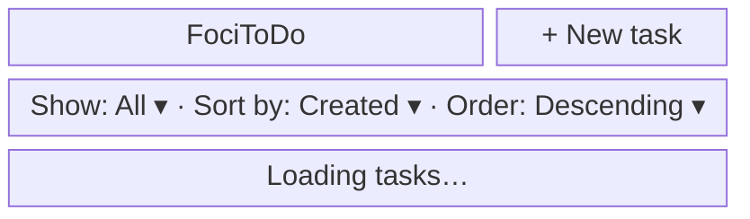

## Task list — empty

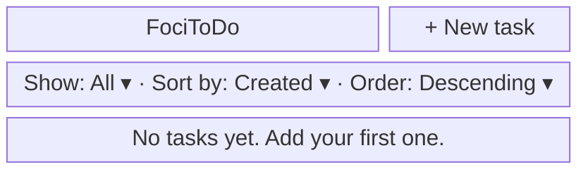

## Task list — with tasks

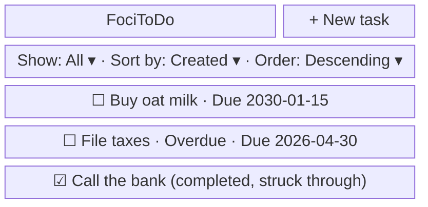

## Task list — no match

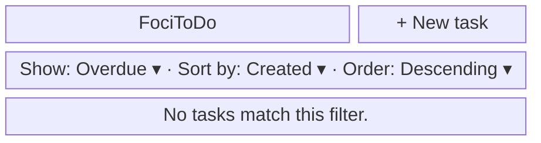

## Task list — load error

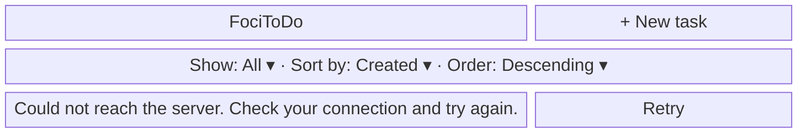

## Filters and sorting

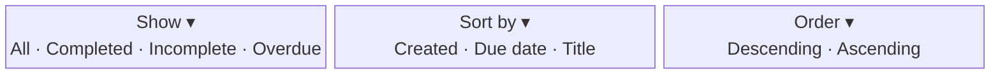

## Dialog — new task

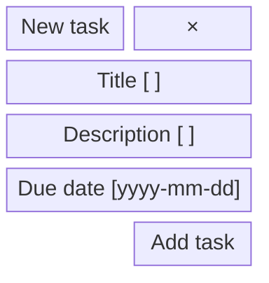

## Dialog — new task with errors

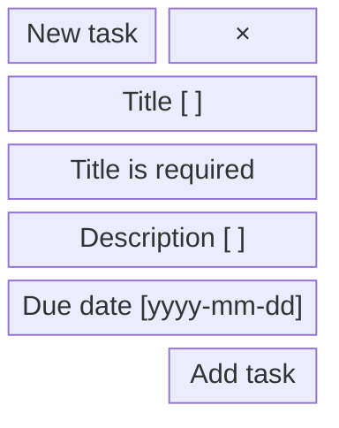

## Dialog — task details

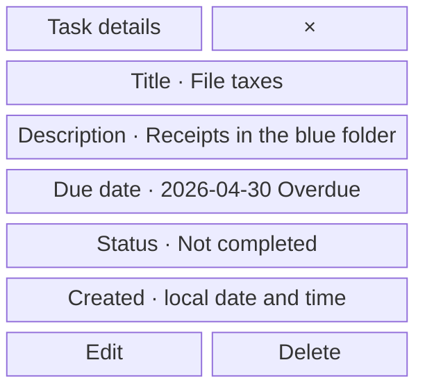

## Dialog — edit task

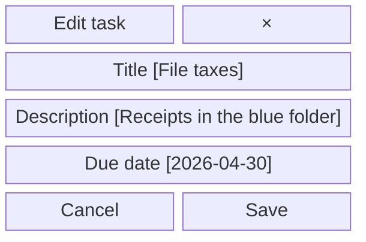

## Dialog — delete confirmation

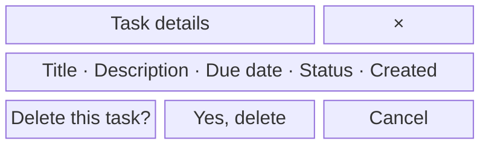

## Dialog — changed elsewhere

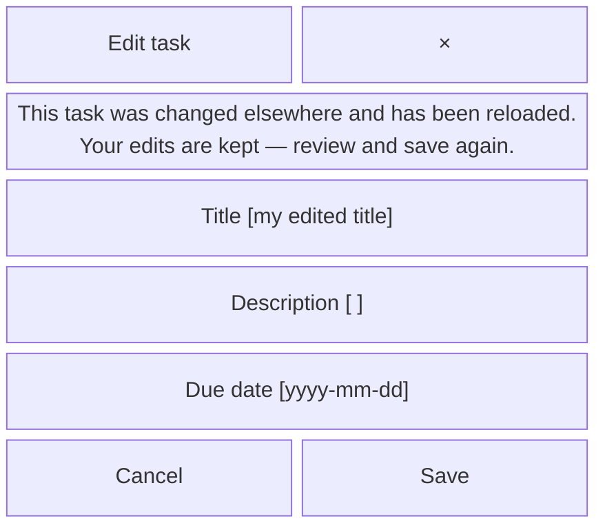

## Dialog — task no longer exists

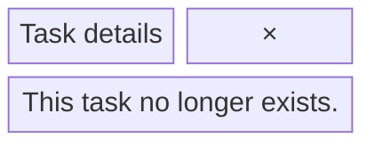
````

- [ ] **Step 2: Generate, then wrap each wireframe as image + collapsed source**

```bash
docker compose --profile docs run --rm --build diagrams
docker compose --profile dev run --rm dev npx vitest run packages/diagrams/tests/check.test.ts
```

Expected: `Rendered 32 diagrams…`; the repository test FAILS listing 13 layout problems for `docs/ui.md` and 13 missing README map rows, each printing the exact expected image line. Wrap every fence in `docs/ui.md` exactly as the existing guides do (image line, blank, `<details><summary>Mermaid source</summary>`, blank, fence, blank, `</details>`, blank), using the image lines the checker prints (``, …).

- [ ] **Step 3: Verify the images**

```bash
find docs/diagrams/ui -name '*.svg' | wc -l          # 13
grep -l 'foreignObject' docs/diagrams/ui/*.svg      # no output
grep -l '&lt;br' docs/diagrams/ui/*.svg             # no output
grep -l 'width="100%"' docs/diagrams/ui/*.svg       # no output
```

Open `filters-and-sorting.svg` and `dialog-changed-elsewhere.svg` as images (convert to PNG in a container if needed) and confirm the `<br/>` labels break onto two lines and all text is readable. If `<br/>` renders literally, replace those labels with separate blocks (one per line) and regenerate.

- [ ] **Step 4: README UI map and architecture link**

In `README.md`'s "Documentation and diagrams" section, add after the Testing block:

```markdown
**[UI](docs/ui.md)** — every screen state of the single-page UI as a wireframe.

| Wireframe                      | Image                                                     | Mermaid source                                       |
| ------------------------------ | --------------------------------------------------------- | ---------------------------------------------------- |
| Task list — loading            | [SVG](docs/diagrams/ui/task-list-loading.svg)             | [source](docs/ui.md#task-list--loading)              |
| Task list — empty              | [SVG](docs/diagrams/ui/task-list-empty.svg)               | [source](docs/ui.md#task-list--empty)                |
| Task list — with tasks         | [SVG](docs/diagrams/ui/task-list-with-tasks.svg)          | [source](docs/ui.md#task-list--with-tasks)           |
| Task list — no match           | [SVG](docs/diagrams/ui/task-list-no-match.svg)            | [source](docs/ui.md#task-list--no-match)             |
| Task list — load error         | [SVG](docs/diagrams/ui/task-list-load-error.svg)          | [source](docs/ui.md#task-list--load-error)           |
| Filters and sorting            | [SVG](docs/diagrams/ui/filters-and-sorting.svg)           | [source](docs/ui.md#filters-and-sorting)             |
| Dialog — new task              | [SVG](docs/diagrams/ui/dialog-new-task.svg)               | [source](docs/ui.md#dialog--new-task)                |
| Dialog — new task with errors  | [SVG](docs/diagrams/ui/dialog-new-task-with-errors.svg)   | [source](docs/ui.md#dialog--new-task-with-errors)    |
| Dialog — task details          | [SVG](docs/diagrams/ui/dialog-task-details.svg)           | [source](docs/ui.md#dialog--task-details)            |
| Dialog — edit task             | [SVG](docs/diagrams/ui/dialog-edit-task.svg)              | [source](docs/ui.md#dialog--edit-task)               |
| Dialog — delete confirmation   | [SVG](docs/diagrams/ui/dialog-delete-confirmation.svg)    | [source](docs/ui.md#dialog--delete-confirmation)     |
| Dialog — changed elsewhere     | [SVG](docs/diagrams/ui/dialog-changed-elsewhere.svg)      | [source](docs/ui.md#dialog--changed-elsewhere)       |
| Dialog — task no longer exists | [SVG](docs/diagrams/ui/dialog-task-no-longer-exists.svg)  | [source](docs/ui.md#dialog--task-no-longer-exists)   |
```

The checker is authoritative for ids and anchors: if it prints a different one, use it. In `docs/architecture.md`'s Frontend section, add one sentence linking `[UI wireframes](ui.md)`. If the README's project layout or any other text states a diagram count, update it to 32.

- [ ] **Step 5: Format, gate, e2e**

```bash
docker compose --profile dev run --rm dev npx prettier --write README.md docs/ui.md docs/architecture.md
docker compose --profile test run --rm --build test
docker compose -p foci-e2e -f compose.yaml -f compose.e2e.yaml run --rm --build e2e; rc=$?
docker compose -p foci-e2e -f compose.yaml -f compose.e2e.yaml down -v; echo "e2e exit: $rc"
```

Expected: gate exit 0 with 100% coverage (the repository test passes); e2e `8 passed`. Prettier must not change Mermaid text; if it does, revert that hunk and regenerate.

- [ ] **Step 6: Commit**

```bash
git add docs/ui.md docs/diagrams README.md docs/architecture.md
git commit -F - <<'EOF'
docs(ui): wireframe every screen state of the single-page UI

docs/ui.md shows the task list (loading, empty, with tasks, no match, load
error), the filter and sort controls and each dialog state (new, errors,
details, edit, delete confirmation, changed elsewhere, no longer exists)
as Mermaid block wireframes, rendered and mapped like every other diagram.

Co-Authored-By: Claude <model> <noreply@anthropic.com>
EOF
```

---

### Finish: pull request

- [ ] Push `docs/ui-wireframes`, open the PR (`docs: UI wireframes for every screen state`; body: summary, spec link, evidence — gate, e2e, 13 new images verified; ends with `🤖 Generated with [Claude Code](https://claude.com/claude-code)`), wait for CI (including the `diagrams` job) to pass; merge only after reviews are clean.
