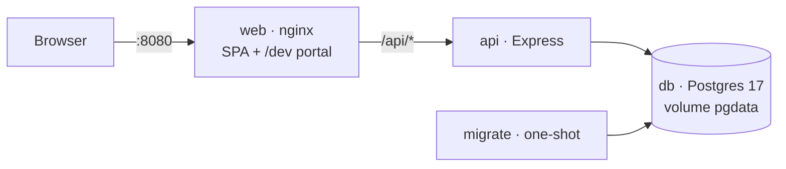
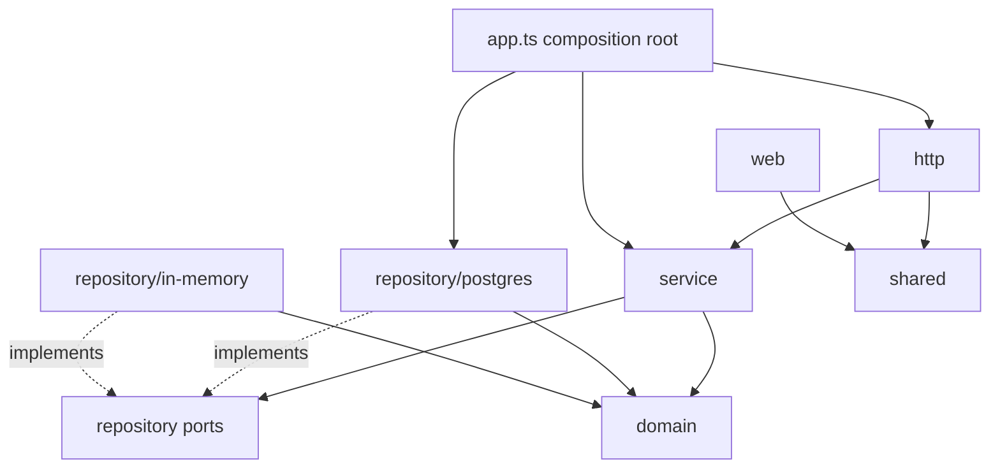
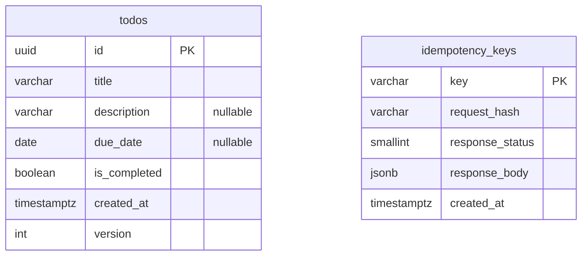
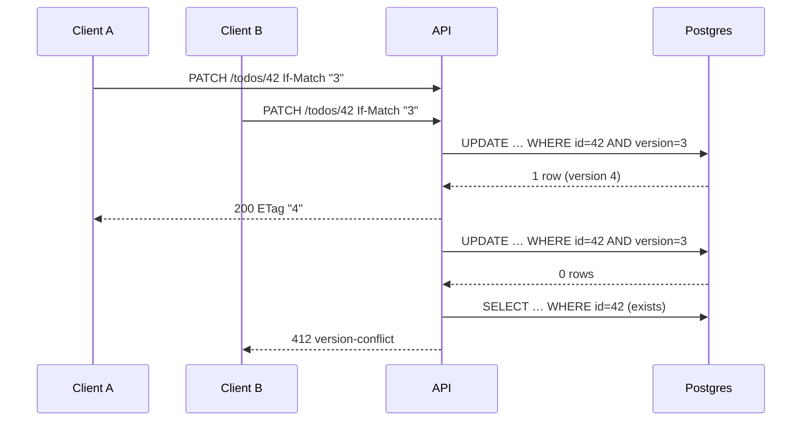

# FociToDo — Design Specification

- **Date:** 2026-09-30
- **Status:** Approved 2026-09-30 · amended during planning (see §14)
- **Source:** the brief ("Build a To-Do List Application") + interactive brainstorming session

> **Amended 2026-10-02:** the in-app `/dev` portal (FR-10, §7.4) was removed — see [ADR 0015](../../decisions/0015-docs-and-diagrams-in-the-repository.md) and [the docs-diagrams spec](2026-10-02-docs-diagrams-design.md). Sections that still mention it describe the original design.

---

## 1. Purpose and success criteria

Build a to-do application that demonstrates **clean architecture, correctness, concurrency safety, thorough automated testing and clear documentation**, runnable by a reviewer who has **only Docker installed**.

The work succeeds when:

1. Every requirement in §2 is implemented and traceable to automated tests.
2. `docker compose up --build` starts the full stack on any machine with Docker (amd64 or arm64), with no other installs.
3. The full test suite runs in Docker, passes, and enforces **100% coverage** (lines, branches, functions, statements).
4. Concurrency guarantees (§6) are proven by deterministic invariant tests and by stress runs against a real server and Postgres.
5. Documentation lets a human understand and run the system in minutes, and lets an AI agent work within its rules.
6. The commit history is curated, green at every commit, and reflects the development process.

---

## 2. Requirements catalog

### 2.1 Functional

| ID | Requirement |
|---|---|
| FR-1 | Add a to-do |
| FR-2 | List all to-dos (title, due date, completion status, overdue flag) |
| FR-3 | View one to-do by ID |
| FR-4 | Update title, description or due date by ID |
| FR-5 | Mark a to-do complete by ID |
| FR-6 | Mark a to-do incomplete by ID |
| FR-7 | Delete a to-do by ID |
| FR-8 | Filter the list: all, completed, incomplete, overdue |
| FR-9 | Sort the list by createdAt, dueDate or title, ascending or descending |
| FR-10 | ~~Browse developer documentation (rendered diagrams, API explorer link, ADRs, build info) from within the web UI at `/dev`~~ — removed 2026-10-02, see [ADR 0015](../../decisions/0015-docs-and-diagrams-in-the-repository.md) and [the docs-diagrams spec](2026-10-02-docs-diagrams-design.md) |

### 2.2 Data

| ID | Field | Rule |
|---|---|---|
| DR-1 | `id` | UUID, server-generated |
| DR-2 | `title` | Required; trimmed; 1–200 characters |
| DR-3 | `description` | Optional; ≤ 2000 characters; empty string stored as `null` |
| DR-4 | ~~`dueDate`~~ | ~~Optional; strict `YYYY-MM-DD`; must be a real calendar date; past dates allowed~~ Superseded by `dueAt`, a UTC instant: see [the 2026-10-03 spec](./2026-10-03-api-docs-and-deadlines-design.md) and [ADR 0017](../../decisions/0017-deadlines-are-utc-instants.md); the brief's `dueDate` is still accepted alongside `dueAt` ([ADR 0018](../../decisions/0018-deadlines-accept-the-briefs-duedate.md)) |
| DR-5 | `isCompleted` | Boolean; defaults to `false` |
| DR-6 | `createdAt` | ISO-8601 UTC timestamp, server-generated |
| DR-7 | `version` | Positive integer, starts at 1, read-only; exposed in body and as `ETag` |
| DR-8 | `isOverdue` | ~~Derived, read-only: `!isCompleted && dueDate < today (UTC)`; never stored~~ Superseded: derived from the `dueAt` instant, with a new `isDueSoon`; see [the 2026-10-03 spec](./2026-10-03-api-docs-and-deadlines-design.md) and [ADR 0017](../../decisions/0017-deadlines-are-utc-instants.md) |

### 2.3 Non-functional

_NFR-10's served `/api/docs` is superseded by ADR 0016._

| ID | Requirement |
|---|---|
| NFR-0 | **Docker is the only prerequisite** to run the app, the tests, the e2e suite and all review checks |
| NFR-1 | TypeScript on Node.js 24 LTS |
| NFR-2 | Data persists across restarts (Postgres with a named volume) |
| NFR-3 | Storage is behind an interface with interchangeable adapters (Postgres, in-memory) |
| NFR-4 | Concurrency safety: atomic writes, no lost updates, idempotent status changes, idempotent create via `Idempotency-Key` |
| NFR-5 | Strict input validation with standard HTTP status codes and RFC 9457 problem details |
| NFR-6 | 100% test coverage, enforced in CI |
| NFR-7 | Layer dependency rules enforced by lint |
| NFR-8 | Multi-stage Docker images; non-root runtimes; production dependencies only |
| NFR-9 | Documentation for humans (README, docs/) and AI agents (CLAUDE.md), with Mermaid diagrams |
| NFR-10 | OpenAPI contract generated from the validation schemas; interactive explorer at `/api/docs` |

### 2.4 Deliverables

| ID | Deliverable |
|---|---|
| D-1 | Public GitHub repository `FociToDo` |
| D-2 | README: build/run instructions |
| D-3 | README: test instructions |
| D-4 | README: design and testing rationale |
| D-5 | README: assumptions |
| D-6 | README: trade-offs |
| D-7 | Curated commit history via PRs |
| D-8 | (withdrawn) |
| D-9 | GitHub Actions CI running the same Docker commands as the README |

---

## 3. Assumptions

_The date-only deadline and UTC-"today" overdue items are superseded by ADR 0017 and ADR 0018._

1. Single user, no authentication or authorization.
2. "Today" for overdue computation is the server's current date in **UTC**. Near midnight this can differ from the user's local date.
3. Past due dates are valid (e.g. logging a task that is already late).
4. Update is partial (PATCH). `null` clears `description` or `dueDate`; `title` cannot be cleared.
5. Complete and incomplete are idempotent and do not require `If-Match`.
6. Delete is a hard delete.
7. No pagination; the list is expected to stay small.
8. Idempotency keys apply to `POST /todos` only and expire after 24 hours.
9. Timestamps are stored and returned in UTC; the UI formats `createdAt` in the browser's locale.

---

## 4. Architecture

### 4.1 System context

_The `/dev` portal in the diagram is superseded by ADR 0015._



Startup order is enforced by Compose: `db` healthy → `migrate` completed successfully → `api` healthy → `web`. Only `web` publishes a port (`WEB_PORT`, default 8080). nginx serves the built SPA and proxies `/api/*` to the API, so the browser sees a single origin and no CORS is needed.

### 4.2 Stack

| Concern | Choice |
|---|---|
| Language / runtime | TypeScript (strict), Node.js 24 LTS |
| Monorepo | npm workspaces: `packages/shared`, `apps/api`, `apps/web` |
| Validation / contract | Zod schemas in `@foci/shared`, used by API, web and OpenAPI generation |
| API | Express 5 (native async error propagation), `pg` with hand-written parameterized SQL |
| Migrations | `node-pg-migrate`, plain `.sql` files |
| Logging | `pino` + `pino-http` (JSON, request id, silent in tests) |
| API docs | Zod's built-in `z.toJSONSchema` assembled into OpenAPI 3.1 + `swagger-ui-express` |
| Web | React + Vite, TanStack Query, Radix Dialog, CSS Modules |
| Dev portal | `react-markdown` + `remark-gfm` + `mermaid` (lazy-loaded) |
| Tests | Vitest (projects), Supertest, React Testing Library + user-event, Playwright |
| Containers | One root multi-stage Dockerfile; Compose with profiles |
| CI | GitHub Actions invoking Docker Compose |

Code style: plain classes and interfaces, constructor injection wired by hand in a composition root, no DI container, no advanced type-level programming.

### 4.3 Repository layout

_The `dev/` portal folder in the layout is superseded by ADR 0015._

```
FociToDo/
├── package.json · package-lock.json · tsconfig.base.json · vitest.config.ts · eslint.config.js
├── Dockerfile                    one multi-stage file; targets: test, api, migrate, web
├── compose.yaml                  default services + profiles test, e2e
├── .env.example · .gitattributes · .gitignore · .dockerignore
├── .github/workflows/ci.yml
├── README.md · CLAUDE.md · AGENTS.md
├── .claude/settings.json         permission allowlist only
├── packages/shared/
│   ├── src/                      todo schemas, list query schema, problem types, header schemas
│   └── tests/                    mirrors src/
├── apps/api/
│   ├── migrations/               *.sql (node-pg-migrate)
│   ├── src/
│   │   ├── domain/               view mapping (isOverdue), domain errors, Clock & IdGenerator ports
│   │   ├── service/              TodoService
│   │   ├── repository/           ports + postgres/ and in-memory/ adapters, UnitOfWork
│   │   ├── http/                 routes, controllers, header handling, errorHandler, openapi registry
│   │   ├── config.ts             Zod-validated environment
│   │   ├── app.ts                composition root; returns an Express app
│   │   └── server.ts             bootstrap: listen, graceful shutdown (coverage-excluded)
│   └── tests/                    mirrors src/
├── apps/web/
│   ├── nginx.conf
│   ├── src/
│   │   ├── api/                  todoClient.ts — the only module that calls fetch
│   │   ├── todos/                hooks + components
│   │   ├── dev/                  /dev portal (lazy chunk)
│   │   ├── App.tsx
│   │   └── main.tsx              mount only (coverage-excluded)
│   └── tests/                    mirrors src/
├── e2e/                          Playwright journeys
└── docs/
    ├── architecture.md · api.md · concurrency.md · testing.md
    ├── decisions/                ADRs
    └── superpowers/specs/ · superpowers/plans/
```

**Test file mirroring rule:** every test lives in its package's `tests/` folder at the path mirroring the source file it tests (`src/service/TodoService.ts` → `tests/service/TodoService.test.ts`). The test kind is encoded in the suffix:

| Suffix | Kind | Needs |
|---|---|---|
| `*.test.ts(x)` | unit / component | nothing |
| `*.int.test.ts` | integration | `db-test` |
| `*.concurrency.test.ts` | concurrency invariants | `db-test` |

Playwright journeys live in root `e2e/`, organised by user journey.

### 4.4 Layer dependency rules

_The web/dev row is superseded by ADR 0015._



| Layer | May import | Must not import |
|---|---|---|
| `domain` | itself, `@foci/shared` types | service, repository, http, `pg`, `express` |
| `service` | domain, repository **ports** | adapters, http, `pg`, `express` |
| `repository/*` adapters | domain, ports, `pg` (postgres only) | service, http |
| `http` | service, domain errors, `@foci/shared` | adapters, `pg` |
| `app.ts` | everything | — |
| `web/todos` | `@foci/shared`, `web/api` | `@foci/api` |
| `web/dev` | docs content, `web/api` | `web/todos` internals |

Enforced with ESLint `import/no-restricted-paths`; a violation fails `test:ci`.

---

## 5. Backend design

### 5.1 Schema

_The `due_date date` column is superseded by `due_at` (ADR 0017); ADR 0018 accepts the brief's `dueDate` on input._

```sql
-- todos
CREATE TABLE todos (
  id            uuid          PRIMARY KEY,
  title         varchar(200)  NOT NULL CHECK (length(btrim(title)) > 0),
  description   varchar(2000),
  due_date      date,
  is_completed  boolean       NOT NULL DEFAULT false,
  created_at    timestamptz   NOT NULL,
  version       integer       NOT NULL DEFAULT 1 CHECK (version > 0)
);
CREATE INDEX todos_created_at_idx ON todos (created_at DESC, id);

-- idempotency_keys
CREATE TABLE idempotency_keys (
  key              varchar(255) PRIMARY KEY,
  request_hash     varchar(64)  NOT NULL,
  response_status  smallint     NOT NULL,
  response_body    jsonb        NOT NULL,
  created_at       timestamptz  NOT NULL
);
```

`id` and `created_at` are supplied by the application through injected `IdGenerator` and `Clock` ports so behaviour is deterministic in tests. Database `CHECK` constraints duplicate the key validation rules as defence in depth.



### 5.2 Domain

_`toView(todo, today)` and the `Clock`-derived UTC "today" are superseded by the `dueAt` instant (ADR 0017)._

- `Todo` (type inferred from the shared schema) and `toView(todo, today)` which adds `isOverdue`.
- Errors: `TodoNotFoundError`, `VersionConflictError`, `PreconditionRequiredError`, `IdempotencyKeyReuseError`. The domain knows nothing about HTTP.
- Ports: `Clock { now(): Date }`, `IdGenerator { next(): string }`.

```mermaid
stateDiagram-v2
  [*] --> Incomplete: create
  Incomplete --> Completed: complete
  Completed --> Incomplete: incomplete
  Incomplete --> [*]: delete
  Completed --> [*]: delete
  note right of Incomplete: isOverdue is derived when dueDate < today (UTC); never stored
```



### 5.3 Repository ports

_The `today` parameter of `list` is superseded by ADR 0017._

```ts
interface TodoRepository {
  create(todo: Todo): Promise<void>;
  findById(id: string): Promise<Todo | null>;
  list(query: ListQuery, today: string): Promise<Todo[]>;
  update(id: string, expectedVersion: number, patch: TodoPatch): Promise<Todo | null>;
  setCompleted(id: string, completed: boolean): Promise<Todo | null>;
  delete(id: string, expectedVersion: number): Promise<boolean>;
}

interface IdempotencyStore {
  find(key: string, notBefore: Date): Promise<StoredResponse | null>;
  claim(record: StoredResponse, notBefore: Date): Promise<boolean>; // false ⇒ a live record already exists
}

interface UnitOfWork {
  run<T>(fn: (repos: { todos: TodoRepository; keys: IdempotencyStore }) => Promise<T>): Promise<T>;
}
```

- **Postgres adapter:** every method except the unit of work is a single SQL statement, so each write is atomic.
- **`update`:** `UPDATE … SET …, version = version + 1 WHERE id = $1 AND version = $2 RETURNING *`. Zero rows → `null`.
- **`setCompleted`:** `UPDATE … SET is_completed = $2, version = version + 1 WHERE id = $1 AND is_completed <> $2 RETURNING *`. Zero rows → re-read with `findById`; returns the unchanged row, or `null` if missing. **The version bumps only on a real state change.**
- **`delete`:** `DELETE FROM todos WHERE id = $1 AND version = $2`. Returns whether a row was deleted.
- **`list`:** filtering and sorting in SQL. Title sort is `lower(title)`. Null `due_date` sorts last in both directions. Every sort has the tie-breakers `created_at DESC, id ASC`, so ordering is fully deterministic.
- **In-memory adapter:** implements identical semantics, including the same comparator and null handling; its `UnitOfWork` serialises callbacks with an async mutex.
- **Contract suite:** one shared test suite runs against both adapters to prove identical behaviour.

### 5.4 Service (`TodoService`)

| Use case | Behaviour |
|---|---|
| `create(input, idempotencyKey?)` | Without key: build the todo (`id` from `IdGenerator`, `createdAt` from `Clock`, `version = 1`, `isCompleted = false`) and insert it. With key: build the todo and its 201 response in memory, then inside `UnitOfWork`: `claim` the key first (`INSERT … ON CONFLICT (key) DO UPDATE … WHERE idempotency_keys.created_at < notBefore`, so an expired record is replaced). Claimed → insert the todo, commit, return 201. Not claimed (a live record exists) → roll back, `find` the record: same request hash → replay the stored response; different hash → `IdempotencyKeyReuseError`. |
| `get(id)` | `findById` or `TodoNotFoundError` |
| `list(query)` | Delegate with `today` = `Clock` date in UTC |
| `update(id, ifMatch, patch)` | Missing `ifMatch` → `PreconditionRequiredError`. `update` returns `null` → `findById`: exists → `VersionConflictError`, missing → `TodoNotFoundError` |
| `complete(id)` / `uncomplete(id)` | `setCompleted`; `null` → `TodoNotFoundError` |
| `delete(id, ifMatch)` | Missing `ifMatch` → `PreconditionRequiredError`. `false` → exists → `VersionConflictError`, missing → `TodoNotFoundError` |

**Idempotent-create race:** claiming the key is the first write in the transaction, and the key's primary key makes concurrent claims serialise. The first transaction claims the key and inserts the todo; the others block on the claim, see a live record once the first commits, roll back without inserting anything, and replay the stored response. Result: exactly one row, every caller receives the same 201 body. A replay returns the original response snapshot even if the todo has since been modified or deleted (standard idempotency-key semantics).

### 5.5 HTTP API

_The served `/api/docs` route is superseded by ADR 0016; the date-only `dueDate` field by ADR 0017 and ADR 0018._

All routes are mounted under `/api` in Express itself, and nginx proxies `/api/*` unchanged, so `Location` headers and OpenAPI paths are identical inside and outside the container network.

| Method | Path | Headers | Success | Errors |
|---|---|---|---|---|
| POST | `/api/todos` | `Idempotency-Key` (optional) | 201 + `Location` + `ETag` (replay adds `Idempotent-Replayed: true`) | 400, 413, 422 |
| GET | `/api/todos?status&sort&order` | — | 200 (array of todo views) | 400 |
| GET | `/api/todos/{id}` | — | 200 + `ETag` | 400, 404 |
| PATCH | `/api/todos/{id}` | `If-Match` (required) | 200 + `ETag` | 400, 404, 412, 413, 428 |
| POST | `/api/todos/{id}/complete` | — (`If-Match` ignored) | 200 + `ETag` | 400, 404 |
| POST | `/api/todos/{id}/incomplete` | — (`If-Match` ignored) | 200 + `ETag` | 400, 404 |
| DELETE | `/api/todos/{id}` | `If-Match` (required) | 204 | 400, 404, 412, 428 |
| GET | `/api/health` | — | 200 `{ status, db, schemaVersion }` | 503 when the database is unreachable |
| GET | `/api/openapi.json` | — | 200 generated OpenAPI document | — |
| GET | `/api/docs` | — | Swagger UI | — |

The rest of this document uses paths without the `/api` prefix for brevity where unambiguous.

**List query:** `status = all | completed | incomplete | overdue` (default `all`); `sort = createdAt | dueDate | title` (default `createdAt`); `order = asc | desc` (default `desc`). Unknown values → 400.

**Validation:** field errors use the field name (or the unknown key's name); body-level errors use `field: null`. Request bodies are strict — unknown keys, and client-supplied `id`, `createdAt`, `isCompleted`, `version` or `isOverdue`, are rejected with 400. Path `id` must be a UUID (400 otherwise). `If-Match` must be a strong ETag `"<positive integer>"`; `*` and malformed values → 400.

**Error precedence** on PATCH and DELETE: **400** (malformed id, body or `If-Match`) → **428** (missing `If-Match`) → **404** (not found) → **412** (version mismatch).

**Error format:** RFC 9457 `application/problem+json`, mapped in one place (`http/errorHandler.ts`):

| Source | Status | `type` |
|---|---|---|
| Validation failure (body, query, params, headers) | 400 | `/problems/validation-error` (+ `errors: [{ field, message }]`) |
| Malformed JSON | 400 | `/problems/malformed-json` |
| Other client errors from the JSON parser (e.g. unsupported charset) | parser's 4xx (e.g. 415) | `/problems/bad-request` |
| `TodoNotFoundError`, unknown route | 404 | `/problems/not-found` |
| `VersionConflictError` | 412 | `/problems/version-conflict` |
| Body too large (limit 16 kB) | 413 | `/problems/payload-too-large` |
| `IdempotencyKeyReuseError` | 422 | `/problems/idempotency-key-reuse` |
| `PreconditionRequiredError` | 428 | `/problems/precondition-required` |
| Anything else | 500 | `/problems/internal` — generic message, no stack trace; full error logged |

### 5.6 Cross-cutting

- **Config:** environment parsed with Zod at startup; invalid config stops the process with a clear message.
- **Logging:** `pino` JSON logs with a request id per request; silent under test.
- **Graceful shutdown:** on `SIGTERM`/`SIGINT`, stop accepting connections, drain in-flight requests, close the pool.
- **OpenAPI:** generated from the shared Zod schemas with Zod's native `z.toJSONSchema` (requests on the input side, responses on the output side) plus hand-written route metadata; tests assert every Express route is registered, responses conform to their documented schemas, and the committed `openapi.json` matches the generated output.

---

## 6. Concurrency guarantees

| Guarantee | Mechanism | Proof (tests) |
|---|---|---|
| Atomic writes | Single-statement writes; transaction for idempotent create | 50 parallel POSTs → exactly 50 rows, 50 unique ids, all valid |
| No lost updates | `version` column, `ETag` / required `If-Match`, conditional `UPDATE`/`DELETE` | 2 parallel PATCHes from the same version → exactly one 200 and one 412; final state equals the winner |
| Idempotent status changes | Conditional `UPDATE … WHERE is_completed <> $2`; version bumps only on change | 20 parallel completes → all 200, `isCompleted = true`, version incremented exactly once |
| Idempotent create | `Idempotency-Key` stored in the same transaction as the todo; primary-key serialisation | 5 parallel POSTs with the same key → 1 row, 5 identical 201 bodies; same key with a different body → 422 |
| Deterministic delete races | Conditional `DELETE`, re-check existence | 10 parallel DELETEs with the current version → exactly one 204 and nine 404 |

Concurrency tests use `Promise.all` against the real API and Postgres, assert invariants rather than timings, and repeat each scenario several rounds.



---

## 7. Frontend design

### 7.1 Structure

_The lazy `DevPortal` route and **Developer** link are superseded by ADR 0015._

- `App.tsx` renders the lazy `DevPortal` when `location.pathname` starts with `/dev`, otherwise `TodoPage`. No router library; nginx falls back to `index.html` for non-file paths.
- **TodoPage:** `Header` (title, **+ New task**, **Developer** link) · `TodoFilters` (status, sort, order) · `TodoList` (loading / error / empty states) → `TodoItem` (checkbox, title, due date, OVERDUE badge; click opens the dialog) · `TodoDialog` (Radix; modes create / view / edit) containing `TodoDetails` and `TodoForm`.
- `TodoForm` and `TodoDetails` are independent of the dialog, so the dialog wrapper can be replaced by an inline panel without touching them.

### 7.2 Data flow

| Action | Request | On success | Special handling |
|---|---|---|---|
| List | `GET /todos` with filters (query key `['todos', filters]`) | — | TanStack Query discards stale responses from superseded filter changes |
| Create | `POST /todos` + `Idempotency-Key` | Invalidate list, close dialog | One key per submission attempt: generated when the form opens, reused on retry of the same submission, regenerated after success; submit disabled while pending |
| Edit | `PATCH` + `If-Match: "<version>"` | Invalidate, return to view mode | 412 → conflict banner, refetch, user's edits preserved in the form |
| Complete / incomplete | `POST …/complete` or `…/incomplete` | Invalidate | Checkbox disabled while pending |
| Delete | `DELETE` + `If-Match` after inline confirmation | Invalidate, close dialog | 412 → conflict banner; 404 → "already deleted", close, refetch |

### 7.3 Rules

_The `dueDate` display rule is superseded by ADR 0017 and ADR 0018._

- **Validation:** shared Zod schema on submit; server `errors[]` from 400 responses mapped onto the same fields.
- **Dates:** `dueDate` displayed as the plain `YYYY-MM-DD` string, never parsed into a `Date`; `createdAt` formatted with `Intl.DateTimeFormat`; overdue badge uses the server's `isOverdue`.
- **Styling:** CSS Modules plus a small `tokens.css` (colour, spacing, radius); system font; no UI kit.
- **Accessibility:** Radix focus management; labelled inputs with `aria-invalid` / `aria-describedby`; checkbox accessible name "Mark '<title>' complete".
- **API client (`todoClient.ts`):** the only module that calls `fetch`; sends `If-Match` and `Idempotency-Key`; parses problem details into `ApiError { status, type, title, errors }`; validates responses with the shared schema.

### 7.4 `/dev` portal (removed 2026-10-02 — see ADR 0015)

- Tabs: **Overview** (the whole README, including "How this was built" and its workflow diagram) · **Architecture** · **API** · **Concurrency** · **Testing** · **Decisions** (ADR list and detail).
- Content: `docs/**/*.md` bundled at build time with `import.meta.glob(..., { query: '?raw', eager: true })`. Single source — no copies.
- Rendering: `react-markdown` + `remark-gfm`; `mermaid` code fences rendered to SVG by a lazily initialised `MermaidBlock` (neutral theme).
- API tab links to `/api/docs` (opens in a new tab); Swagger UI is not embedded.
- Tab state in the URL hash (`/dev#concurrency`); relative Markdown links rewritten to portal tabs; code links point to GitHub.
- Header shows build info (`APP_VERSION`, `GIT_SHA`, `BUILD_DATE`) injected at build time through Vite `define` from Docker build arguments.
- The portal (including `mermaid`) is a separate lazily loaded chunk.

---

## 8. Containers and delivery

### 8.1 Dockerfile (single, multi-stage, at repo root)

`base` (node:24-alpine) → `deps` (one cached `npm ci` for all workspaces) → `source` → targets:

| Target | Built from | Contents |
|---|---|---|
| `test` | `source` | All workspaces and dev dependencies; `CMD npm run test:ci` |
| `api` | `build-api` + `api-prod-deps` | Compiled API, compiled shared package, production dependencies, migrations; runs as `node`; healthcheck on `/api/health` |
| `migrate` | `api` | Same image; command `node-pg-migrate up` with SQL migrations |
| `e2e` | Playwright image `v1.63.0-noble` | Only `@playwright/test@1.63.0` installed + `e2e/` specs |
| `web` | `build-web` | `nginxinc/nginx-unprivileged` (alpine) serving the built SPA; `nginx.conf` with SPA fallback and `/api` proxy |

All base images are pinned and multi-architecture. The build context is the repo root; `.dockerignore` excludes `node_modules`, reports and VCS data.

### 8.2 Compose

| Service | Profile | Notes |
|---|---|---|
| `db` | default | postgres:17.11-alpine initialised with `--locale-provider=builtin --builtin-locale=C.UTF-8`; `pg_isready` healthcheck; volume `pgdata`; no published port |
| `migrate` | default | depends on `db` healthy; exits 0 |
| `api` | default | depends on `migrate` completed successfully; `read_only: true` with tmpfs `/tmp`; healthcheck |
| `web` | default | publishes `${WEB_PORT:-8080}:8080`; depends on `api` healthy |
| `db-test` | test, dev | postgres:17.11-alpine on tmpfs (same locale); healthcheck |
| `test` | test | target `test`; `DATABASE_URL` → `db-test`; bind mount `./reports` (coverage in `reports/coverage`) |
| `dev` | dev | target `deps`; bind-mounted repo + named `node_modules` volume; developer TDD loop only |
| `e2e` | overlay `compose.e2e.yaml` | target `e2e`; `BASE_URL=http://web:8080`; bind mount `./reports` (report in `reports/e2e`); the overlay also removes `web`'s host port |

Development credentials are defaults in `compose.yaml`, overridable through `.env`.

### 8.3 Reviewer commands

_The `/dev` portal in the commands is superseded by ADR 0015; the `/api/docs` explorer by ADR 0016._

```bash
docker compose up --build -d                   # app: http://localhost:8080 · portal: /dev · API explorer: /api/docs
docker compose --profile test run --rm --build test   # lint, typecheck, all tests, 100% coverage → reports/coverage/index.html
docker compose -p foci-e2e -f compose.yaml -f compose.e2e.yaml run --rm --build e2e
docker compose -p foci-e2e -f compose.yaml -f compose.e2e.yaml down -v
docker compose down -v                         # stop and remove data
```

Prerequisite: Docker with Compose v2.24+. The e2e suite runs under a separate Compose project name with no host port, so it never touches the demo data or collides with it.

### 8.4 CI

`.github/workflows/ci.yml` runs on pull requests and on `main`:

1. `test` — the test-profile command; uploads `coverage/`.
2. `e2e` (needs `test`) — the isolated e2e command; uploads `reports/e2e`.
3. `images` — builds the `api`, `migrate` and `web` targets.

README badges: CI status (GitHub native) and a static "coverage 100% · enforced" badge linking to the workflow.

---

## 9. Testing strategy

### 9.1 Layers

| Layer | Location / suffix | Runs against | Purpose |
|---|---|---|---|
| Shared schema | `packages/shared/tests/**/*.test.ts` | — | Every validation rule and boundary |
| Domain + service | `apps/api/tests/{domain,service}/**/*.test.ts` | in-memory adapter, fake clock/ids | Business rules, error selection, idempotency logic |
| Repository contract | `apps/api/tests/repository/**` (`.test.ts` for in-memory, `.int.test.ts` for Postgres) | both adapters | Identical behaviour: filters, sorting, nulls, tie-breakers, version checks |
| HTTP integration | `apps/api/tests/http/**/*.int.test.ts` | Supertest → Postgres | Status codes, headers, problem details, error precedence, OpenAPI conformance |
| Concurrency | `apps/api/tests/http/**/*.concurrency.test.ts` | Supertest → Postgres | Invariants in §6 |
| Web | `apps/web/tests/**/*.test.tsx` | jsdom, mocked `todoClient` (client itself tested with stubbed `fetch`; `mermaid` mocked) | UI states, validation, conflict handling, idempotency-key reuse, dialog accessibility, portal navigation |
| End-to-end | `e2e/*.spec.ts` | Playwright → full stack | Full lifecycle; validation round trip; 412 conflict; persistence after reload |

### 9.2 Execution

Vitest projects in the root config: `shared`, `api-unit`, `api-db`, `web`. The `api-db` project waits for `db-test`, applies migrations with the production `node-pg-migrate` command, runs files sequentially, and truncates tables before each test. `test:ci` = lint (including layer rules) → typecheck → `vitest run --coverage` → Playwright version-pin check.

### 9.3 Coverage policy

- Thresholds: **100%** lines, branches, functions and statements, merged across projects; enforced in `test:ci` and CI.
- Exclusions (listed explicitly in config and in `docs/testing.md`): `apps/api/src/server.ts`, `apps/web/src/main.tsx`, `*.d.ts`, migrations. Playwright is not counted.
- Testability by design: pool, clock, id generator and config are injected.
- No `v8 ignore` comments without an adjacent written justification; the target is zero, and any occurrence is justified in place.

---

## 10. Documentation

| File | Audience | Contents |
|---|---|---|
| `README.md` | Reviewers | Overview + screenshot; quick start; running tests; design overview with links; assumptions; trade-offs (design only); how this was built (AI-assisted workflow); one-line OpenAPI justification |
| `CLAUDE.md` | AI agents | Docker commands; layer rules; test mirroring and suffix rules; TDD; Conventional Commits and curated PRs; generated files not edited by hand |
| `AGENTS.md` | Other AI tools | Pointer to `CLAUDE.md` |
| `docs/architecture.md` | Engineers | Layers, composition root, ports, data model, frontend structure — context, layer, state, ER, frontend-flow and deployment diagrams |
| `docs/api.md` | API consumers | Endpoints, headers, error precedence, problem types, curl examples — one sequence diagram per endpoint with happy and error branches |
| `docs/concurrency.md` | Reviewers | The guarantees, mechanisms and proving tests — three race-scenario diagrams |
| `docs/testing.md` | Engineers | Layers, mirroring and suffixes, commands, coverage policy — test topology diagram |
| `docs/decisions/` | Everyone | ADRs (below) |

Each Mermaid diagram stays small (about 15 lines) and sits next to the text it explains.

**ADRs:** 0001 TypeScript monorepo · 0002 Postgres with `pg` and plain SQL · 0003 `node-pg-migrate` and one-shot migrate service · 0004 Optimistic locking with ETag/If-Match · 0005 Idempotent status actions and Idempotency-Key · 0006 PATCH plus action routes · 0007 RFC 9457 problem details · 0008 Server-side UTC overdue · 0009 OpenAPI generated from Zod · 0010 Single-page UI with Radix dialog and TanStack Query · 0011 In-app `/dev` portal single-sourced from docs (superseded by 0015) · 0012 Single multi-stage Dockerfile and Compose profiles · 0013 Test strategy and 100% coverage gate · 0014 Curated PR workflow and AI attribution.

---

## 11. Verification

The app's own test gate, end-to-end suite and concurrency tests.

---

## 12. Development workflow

- **Process:** this spec → implementation plan → TDD per task → milestone review → curated PR → merge.
- **Branches:** one feature branch per work package, merged into `main` through a PR with a merge commit.
- **Curated history:** before a PR opens, the branch is tidied into a few meaningful commits; fixups and review fixes are folded into the commit they belong to (`--fixup` + non-interactive autosquash). `main` is never rewritten. Every commit on `main` builds and passes tests.
- **Commits:** Conventional Commits with scope; failing test and implementation land in the same commit; every commit carries a `Co-Authored-By: Claude` trailer.
- **Claude configuration committed:** `CLAUDE.md`, `AGENTS.md`, `.claude/settings.json` (permission allowlist), specs and plans. No hooks, custom skills or additional agents.

---

## 13. Out of scope

Authentication and multi-user support · pagination · soft delete / audit history · `completedAt` · client-supplied "today" for overdue · real-time updates · internationalisation · dark mode · a hosted deployment.

---

## 14. Amendments made during planning (2026-09-30)

| # | Change | Reason |
|---|---|---|
| A1 | OpenAPI generated with Zod's built-in `z.toJSONSchema` instead of `@asteasolutions/zod-to-openapi` | zod-to-openapi 9 cannot document schemas created before its Zod extension runs (verified); the native converter handles all schemas (verified) |
| A2 | Problem type `/problems/bad-request` for other JSON-parser client errors | Avoids 500s for client mistakes such as unsupported charsets |
| A3 | Postgres initialised with the built-in `C.UTF-8` locale | Deterministic Unicode-aware `lower()`, matched by the in-memory comparator |
| A4 | Test command includes `--build` | The image always reflects the checked-out code |
| A5 | e2e image is a Dockerfile target on the Playwright image | Reviewers have no host `node_modules` |
| A6 | `dev` Compose profile for the developer loop | Tools that write files (Prettier, npm) run without host Node |
| A7 | `/dev` Overview renders the whole README | Simpler and more useful |
| A8 | Body-level validation errors use `field: null` | Precise, mappable errors |
| A9 | e2e via an override file and `docker compose run` | `up --exit-code-from` aborts when the one-shot `migrate` exits; no host-port collision with a running demo |
| A10 | `request_hash` is `varchar(64)` | Avoids `char` padding |
| A11 | Reviewer prerequisite: Compose v2.24+ | `!reset` in the e2e override |
| A12 | TypeScript pinned to `~6.0` | typescript-eslint supports TypeScript < 6.1 |
