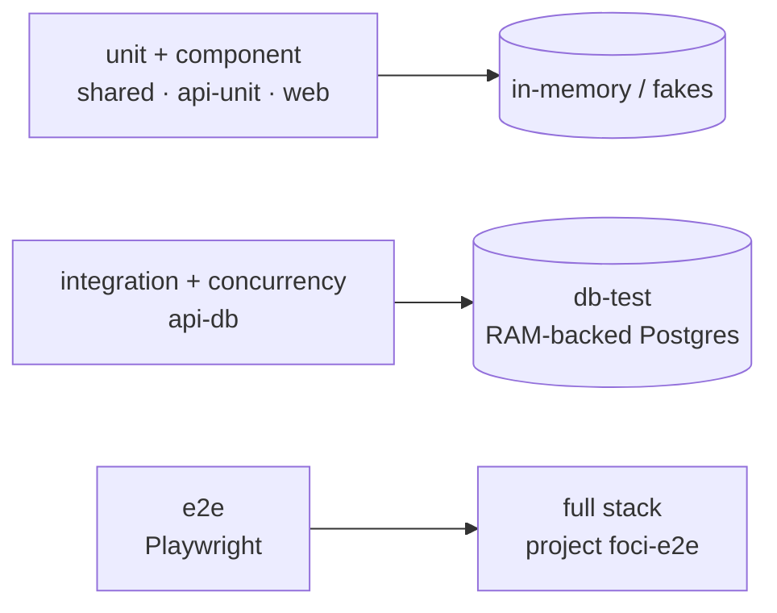

# Testing

```bash
docker compose --profile test run --rm --build test   # format, lint, typecheck, all Vitest layers, 100% coverage
docker compose -p foci-e2e -f compose.yaml -f compose.e2e.yaml run --rm --build e2e   # Playwright
docker compose -p foci-e2e -f compose.yaml -f compose.e2e.yaml down -v
```

Reports: `reports/coverage/index.html`, `reports/e2e/index.html`.

The gate also fails when a diagram image is stale, missing or orphaned, or a diagram is missing from the README map (fix: `docker compose --profile docs run --rm --build diagrams`); when a source file a diagram depicts (`docs/diagram-depicts.json`) changed since the diagram was last stamped (review the diagram, then the same command); and when the screenshots are stale or a PNG was edited by hand (`docs/images/manifest.json`; fix: `docker compose --profile docs run --rm --build screenshots`).

## Layers

| Layer               | Where                                       | Runs against                                   | Proves                                                                        |
| ------------------- | ------------------------------------------- | ---------------------------------------------- | ----------------------------------------------------------------------------- |
| Shared schema       | `packages/shared/tests`                     | —                                              | Every validation rule and boundary                                            |
| Domain and service  | `apps/api/tests/{domain,service}`           | in-memory storage, fixed clock, sequential ids | Business rules, error selection, idempotency logic                            |
| Repository contract | `apps/api/tests/repository`                 | **both** adapters                              | Identical filtering, sorting, versioning, expiry and atomicity                |
| HTTP integration    | `apps/api/tests/http/*.int.test.ts`         | Supertest → Postgres                           | Status codes, headers, problem details, error precedence, OpenAPI conformance |
| Concurrency         | `apps/api/tests/http/*.concurrency.test.ts` | real server → Postgres                         | The invariants in [concurrency.md](./concurrency.md)                          |
| Web                 | `apps/web/tests`                            | jsdom, fake `TodoClient`                       | UI states, validation, conflicts, idempotency keys, dialog accessibility      |
| End-to-end          | `e2e/`                                      | Playwright → nginx → API → Postgres            | The deployed stack works as a whole                                           |



<details><summary>Mermaid source</summary>



</details>

## Conventions

- **Mirrored paths:** `src/service/TodoService.ts` → `tests/service/TodoService.test.ts` in the same package. Exception: `apps/api/src/http/createHttpApp.ts`, the in-memory adapters (`InMemoryDatabase`, `InMemoryIdempotencyStore`, `InMemoryTodoRepository`, `InMemoryUnitOfWork`), the Postgres adapters (`PgIdempotencyStore`, `PgTodoRepository`) and `repository/postgres/rows.ts` are tested through the shared repository contract suite (`tests/repository/repository.contract.ts`) and the route tests rather than a mirrored file.
- **Suffixes:** `.test.ts(x)` needs nothing; `.int.test.ts` and `.concurrency.test.ts` need Postgres and run in the `api-db` project, one file at a time, with tables truncated before each test. The harness refuses any database whose name does not end in `_test`.
- **Contract suite:** `tests/repository/repository.contract.ts` runs against the in-memory and Postgres adapters, so the fast unit tests rely on an in-memory adapter that provably behaves like Postgres.
- **Determinism:** clock, id generator and pool are injected; concurrency tests assert invariants, never timings.

## Coverage policy

- 100% lines, branches, functions and statements, merged across all Vitest projects, enforced by the test gate and CI.
- Excluded (no logic): `apps/api/src/server.ts` (process bootstrap), `apps/web/src/main.tsx` (React mount), `packages/diagrams/src/bin.ts` (command-line entry point), `*.d.ts`.
- No `v8 ignore` comments. Hard-to-reach branches are made reachable by injecting the dependency instead.
- Coverage is a floor, not the goal: concurrency tests were checked by temporarily removing the version condition from the SQL (they fail), and e2e journeys by changing a UI message (they fail).

## Known edges

- Titles sort case-insensitively by code point (`lower(title) COLLATE "C"` with Postgres' built-in `C.UTF-8` locale; the in-memory adapter mirrors it). Rare characters whose lowercase form differs between JavaScript and Postgres' simple case mapping could order differently between the two adapters.
