# UI

FociToDo is a single page: a header, the filter and sort controls, and the task list. Creating, viewing, editing and deleting a task happen in one dialog; completing it is the checkbox on its row. These wireframes show each screen state's layout, elements and wording; they are deliberately low-fidelity. For the real look, see the generated screenshots in [`images/`](images/) — [the task list](images/screenshot.png) and [the edit dialog](images/edit-dialog.png).

**Notation:** each box is one element of the screen; `[ ]` an input (with its value, if any); `▾` a select showing its current value; `☐` / `☑` a row's checkbox (unticked / ticked); `×` closes the dialog.

## Task list — loading

While the first list request is in flight.

Mermaid source

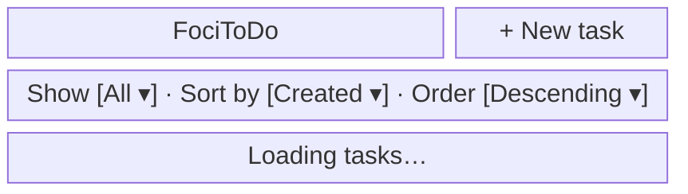

## Task list — empty

After the list request succeeds with no tasks and the filter is All.

Mermaid source

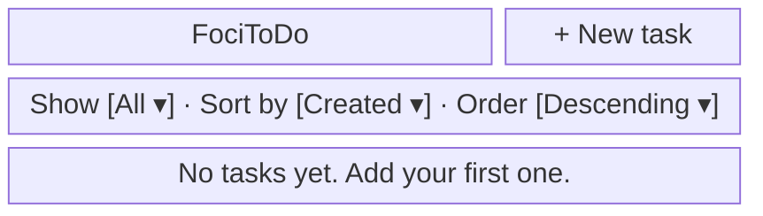

## Task list — with tasks

After the list request succeeds with tasks, including one overdue, one due soon and one completed.

Mermaid source

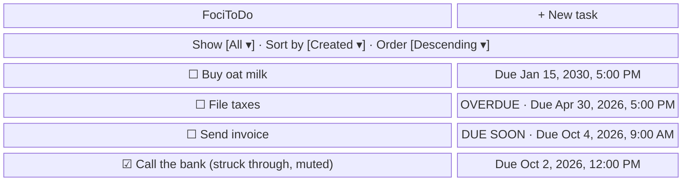

## Task list — no match

After the list request succeeds with no tasks matching a filter other than All.

Mermaid source

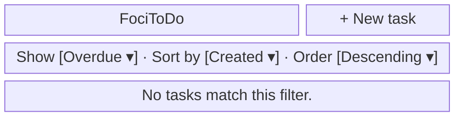

## Task list — load error

When the first list request fails there is nothing to show yet; Retry sends it again.

Mermaid source

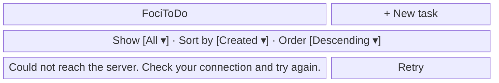

## Task list — refresh failed

When a background refresh fails after the tasks have loaded: the rows stay on screen with the notice and Retry above them; the notice clears on the next successful refresh.


Mermaid source

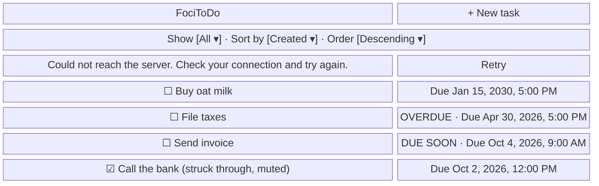

## Filters and sorting

Rendered above the task list in every list state, shown here with each select's options expanded.

Mermaid source

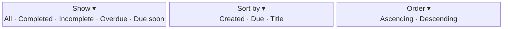

## Dialog — new task

After + New task is clicked, before anything is typed.

Mermaid source

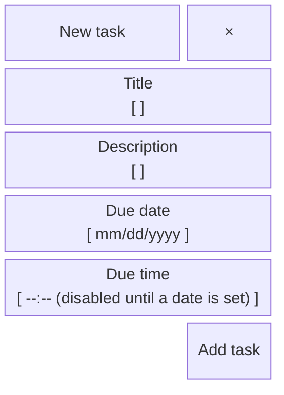

## Dialog — new task with errors

After Add task is submitted with the title left empty.

Mermaid source

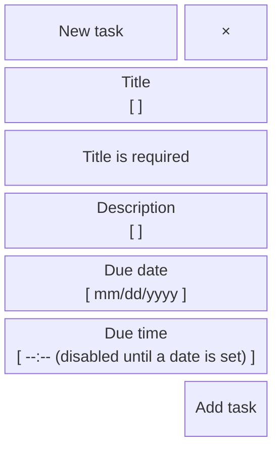

## Dialog — task details

After a task is opened from the list and its details load; this task is overdue. If a background refresh fails, the details (or the edit form, with any typed changes) stay on screen with a notice above them.

Mermaid source

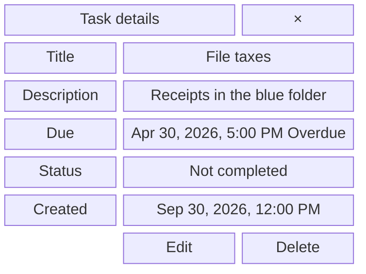

## Dialog — edit task

After Edit is clicked in task details, the form prefilled with the task's current values.

Mermaid source

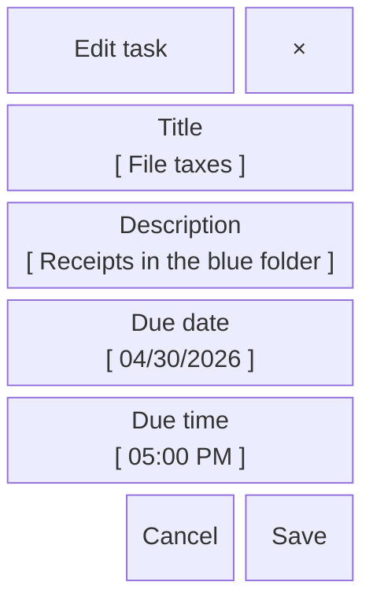

The same dialog in the app, generated from the built web app by the screenshots command:

## Dialog — delete confirmation

After Delete is clicked in task details, before the deletion is confirmed.

Mermaid source

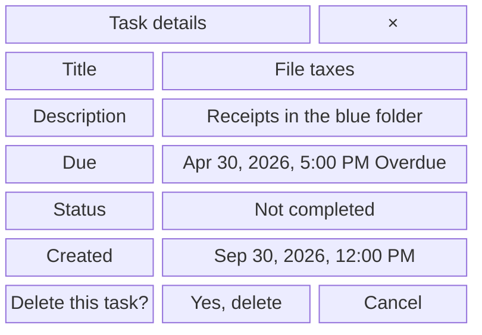

## Dialog — changed elsewhere

After Save is rejected because someone else changed the task (HTTP 412): the task is reloaded, the fields the user edited keep their edits, and the others show the reloaded values.

Mermaid source

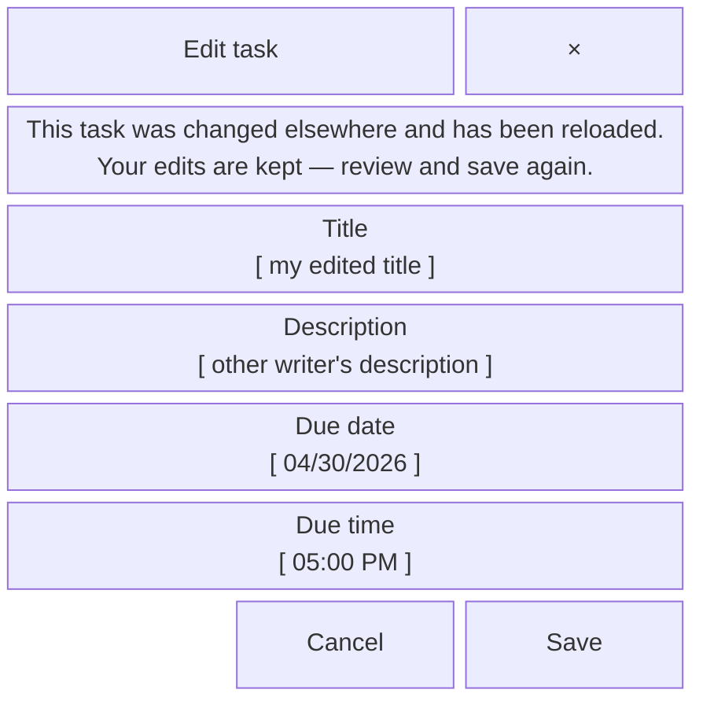

## Dialog — refresh failed

When a background refresh of an open task fails: the details or the edit form stay on screen, typed changes kept, with the notice above them; the notice clears on the next successful refresh.


Mermaid source

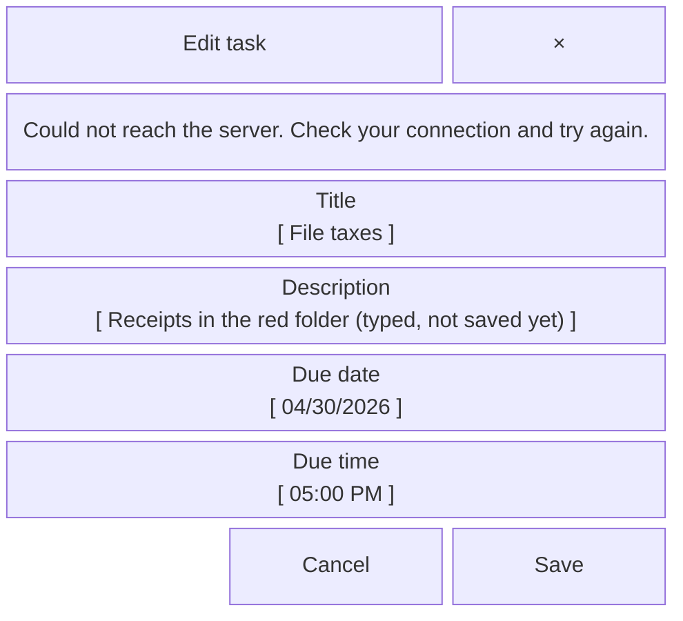

## Dialog — task no longer exists

When a task opened from the list was deleted elsewhere (HTTP 404).

Mermaid source

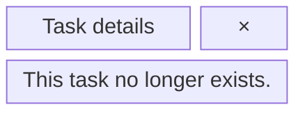

