# UI

FociToDo is a single page: a header, the filter and sort controls, and the task list. Creating, viewing, editing and deleting a task happen in one dialog; completing it is the checkbox on its row. These wireframes show each screen state.

**Notation:** each box is one element of the screen; `[ ]` an input (with its value, if any); `▾` a select showing its current value; `☐` / `☑` a row's checkbox (unticked / ticked); `×` closes the dialog.

The companion review repository's storyboard, [FociToDo-review](https://github.com/charlesmalo/FociToDo-review), shows the running app beside each wireframe.

## Task list — loading

While the first list request is in flight.

Mermaid source

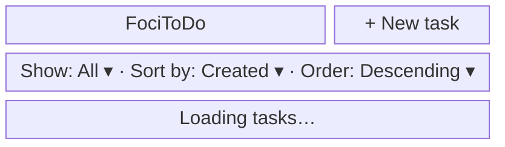

## Task list — empty

After the list request succeeds with no tasks and the filter is All.


Mermaid source

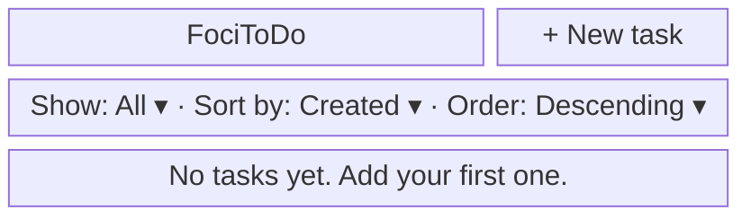

## Task list — with tasks

After the list request succeeds with tasks, including one overdue, one due soon and one completed.


Mermaid source

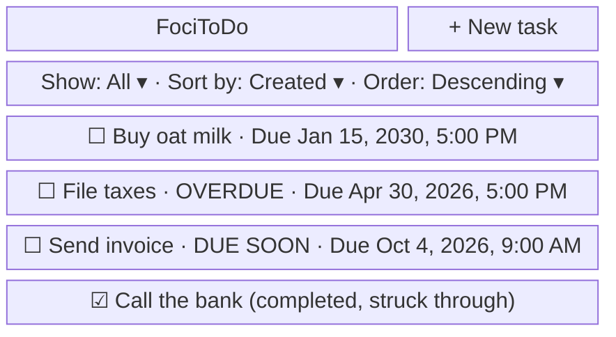

## Task list — no match

After the list request succeeds with no tasks matching a filter other than All.


Mermaid source

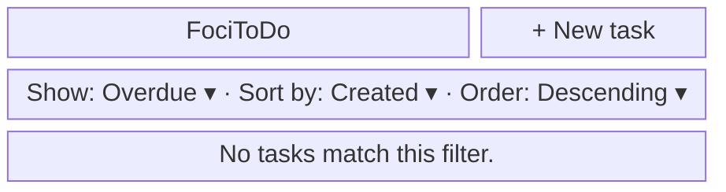

## Task list — load error

After the list request fails; Retry sends it again.

Mermaid source

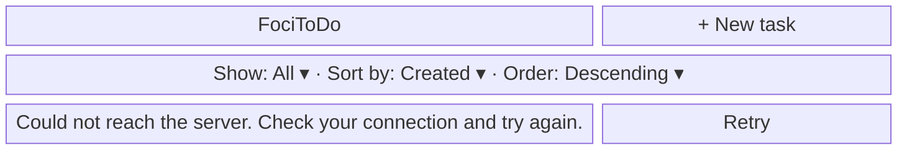

## Filters and sorting

Rendered above the task list in every list state, shown here with each select's options expanded.


Mermaid source

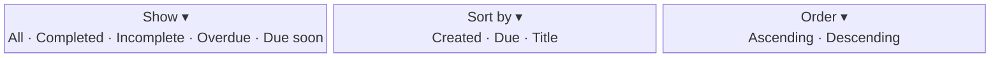

## Dialog — new task

After + New task is clicked, before anything is typed.


Mermaid source

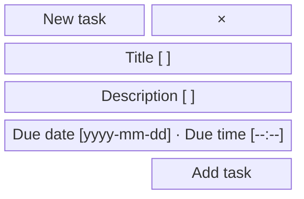

## Dialog — new task with errors

After Add task is submitted with the title left empty.


Mermaid source

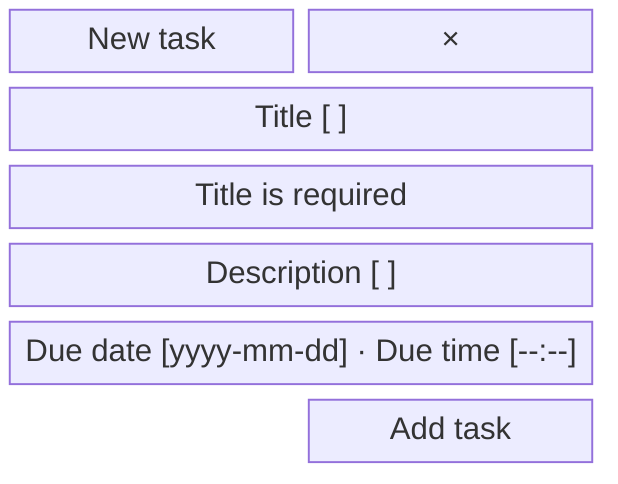

## Dialog — task details

After a task is opened from the list and its details load; this task is overdue.


Mermaid source

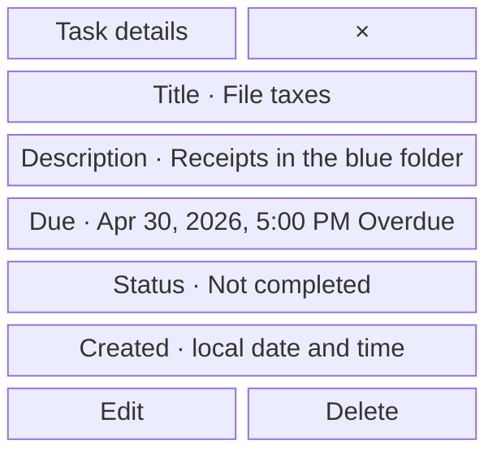

## Dialog — edit task

After Edit is clicked in task details, the form prefilled with the task's current values.


Mermaid source

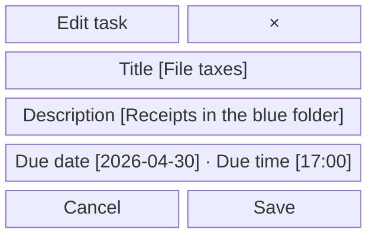

The same dialog in the app, generated from the built web app by the screenshots command:

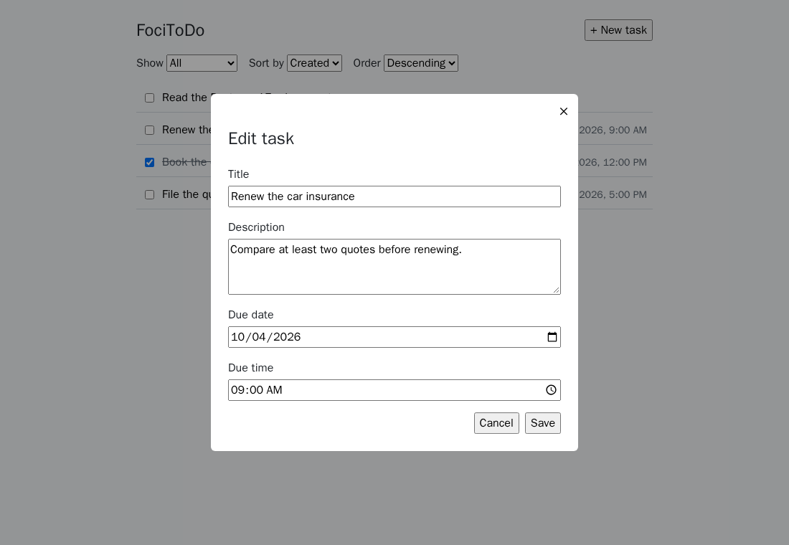

## Dialog — delete confirmation

After Delete is clicked in task details, before the deletion is confirmed.


Mermaid source

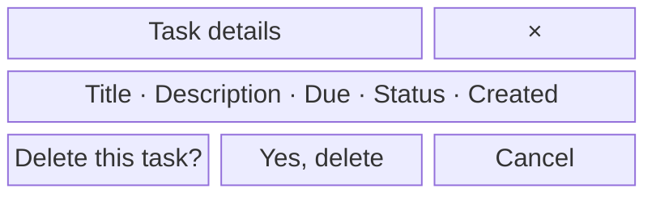

## Dialog — changed elsewhere

After Save is rejected because someone else changed the task (HTTP 412).

Mermaid source

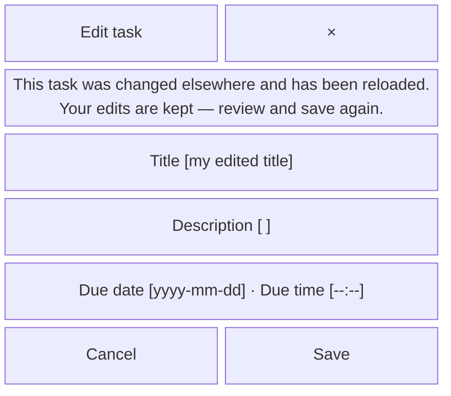

## Dialog — task no longer exists

When a task opened from the list was deleted elsewhere (HTTP 404).

Mermaid source

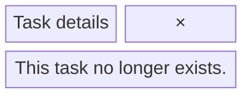

